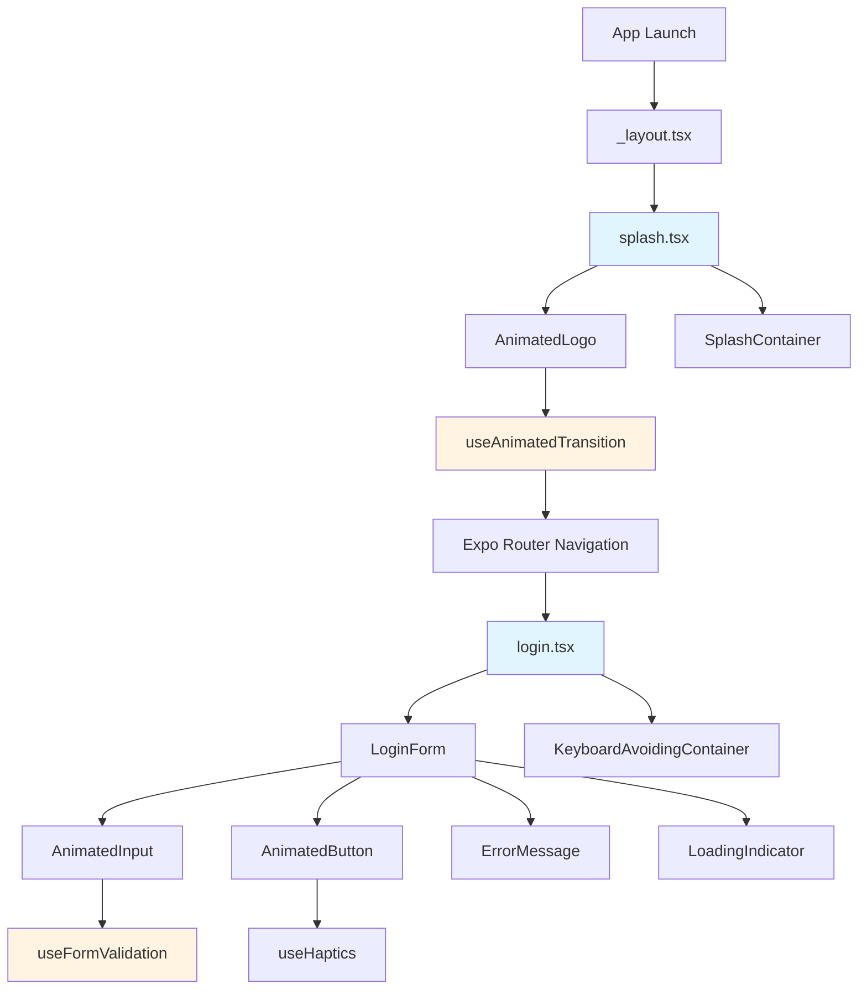

# Documento de Diseño Técnico

## Overview

Esta característica implementa una experiencia de bienvenida moderna para la aplicación React Native/Expo, compuesta por dos pantallas principales: una pantalla de presentación (splash) animada y una pantalla de login con diseño contemporáneo. El sistema utiliza React Native Reanimated 4.x para animaciones de alto rendimiento y Expo Router para la navegación declarativa.

### Objetivos Principales

1. **Experiencia Visual Fluida**: Proporcionar animaciones suaves y profesionales que mejoren la percepción de calidad de la aplicación
2. **Rendimiento Óptimo**: Utilizar animaciones nativas mediante Reanimated para mantener 60 FPS
3. **Accesibilidad Universal**: Garantizar que todos los usuarios puedan autenticarse independientemente de sus capacidades
4. **Adaptabilidad**: Soportar diferentes tamaños de pantalla, orientaciones y preferencias de tema del sistema

### Flujo de Usuario

```
App Launch → Splash Screen (animación entrada) → Splash Screen (animación salida) → Login Screen (animación entrada) → Autenticación
```

### Tecnologías Clave

- **React Native Reanimated 4.x**: Sistema de animaciones que ejecuta en el thread nativo
- **Expo Router**: Sistema de navegación basado en archivos
- **Expo Haptics**: Retroalimentación táctil
- **TypeScript**: Tipado estático para mayor seguridad
- **React Native Safe Area Context**: Manejo de áreas seguras en dispositivos modernos

## Architecture

### Estructura de Componentes

El sistema se organiza en una arquitectura de componentes modulares que separa las responsabilidades de presentación, lógica de animación y gestión de estado.

```
app/
├── _layout.tsx                    # Root layout con configuración de navegación
├── splash.tsx                     # Pantalla de splash (punto de entrada)
├── login.tsx                      # Pantalla de login
└── (auth)/                        # Grupo de rutas de autenticación (futuro)

components/
├── splash/
│   ├── AnimatedLogo.tsx          # Logo con animaciones de entrada/salida
│   └── SplashContainer.tsx       # Contenedor con gestión de tema
├── login/
│   ├── LoginForm.tsx             # Formulario principal de login
│   ├── AnimatedInput.tsx         # Campo de entrada con animaciones
│   ├── AnimatedButton.tsx        # Botón con feedback visual y háptico
│   ├── ErrorMessage.tsx          # Mensaje de error con animación de sacudida
│   └── LoadingIndicator.tsx      # Indicador de carga animado
└── shared/
    ├── ThemedView.tsx            # Contenedor con soporte de tema
    └── KeyboardAvoidingContainer.tsx  # Contenedor que maneja el teclado

hooks/
├── useAnimatedTransition.ts      # Hook para transiciones entre pantallas
├── useFormValidation.ts          # Hook para validación de formularios
├── useTheme.ts                   # Hook para acceso al tema actual
└── useKeyboardHeight.ts          # Hook para detectar altura del teclado

utils/
├── animations.ts                 # Configuraciones de animación reutilizables
├── validation.ts                 # Funciones de validación
└── haptics.ts                    # Wrapper para feedback háptico

types/
└── auth.ts                       # Tipos relacionados con autenticación
```

### Diagrama de Arquitectura



### Patrones de Diseño

1. **Compound Components**: Los componentes de login se componen de subcomponentes especializados que trabajan juntos
2. **Custom Hooks**: La lógica de animación, validación y tema se encapsula en hooks reutilizables
3. **Render Props Pattern**: Para componentes que necesitan compartir lógica de animación
4. **Container/Presentational**: Separación entre lógica de negocio y presentación visual

### Flujo de Navegación

La navegación utiliza Expo Router con el siguiente flujo:

1. **Inicio**: `_layout.tsx` configura el Stack Navigator
2. **Splash**: `splash.tsx` se muestra como pantalla inicial
3. **Transición**: Después de las animaciones, se usa `router.replace('/login')` para evitar volver atrás
4. **Login**: `login.tsx` se presenta con animación de entrada

## Components and Interfaces

### Componentes de Splash Screen

#### AnimatedLogo

Componente que renderiza y anima el logo de la aplicación.

```typescript
interface AnimatedLogoProps {
  onAnimationComplete: () => void;
  size?: number;
}

// Animaciones:
// - Entrada: scale (0 → 1) + opacity (0 → 1) en 1500ms
// - Salida: scale (1 → 1.2) + opacity (1 → 0) en 800ms
// - Easing: Easing.bezier(0.25, 0.1, 0.25, 1) para entrada
//          Easing.out(Easing.exp) para salida
```

**Responsabilidades**:
- Renderizar el logo o marca de la aplicación
- Ejecutar animación de entrada al montarse
- Ejecutar animación de salida cuando se complete el tiempo de visualización
- Notificar cuando las animaciones se completen mediante callback

#### SplashContainer

Contenedor principal de la pantalla splash con soporte de tema.

```typescript
interface SplashContainerProps {
  children: React.ReactNode;
}

// Colores por tema:
// - Light: background: '#FFFFFF', logo: '#000000'
// - Dark: background: '#000000', logo: '#FFFFFF'
```

**Responsabilidades**:
- Proporcionar fondo con color adaptado al tema del sistema
- Centrar contenido vertical y horizontalmente
- Aplicar SafeAreaView para evitar superposición con notches

### Componentes de Login Screen

#### LoginForm

Componente principal que orquesta el formulario de login.

```typescript
interface LoginFormProps {
  onSubmit: (credentials: LoginCredentials) => Promise<void>;
}

interface LoginCredentials {
  email: string;
  password: string;
}

interface FormState {
  email: string;
  password: string;
  errors: {
    email?: string;
    password?: string;
  };
  isLoading: boolean;
  showPassword: boolean;
}
```

**Responsabilidades**:
- Gestionar el estado del formulario (valores, errores, carga)
- Coordinar animaciones de entrada de elementos
- Validar campos antes de enviar
- Manejar el proceso de autenticación
- Mostrar errores de validación

#### AnimatedInput

Campo de entrada con animaciones y validación visual.

```typescript
interface AnimatedInputProps {
  value: string;
  onChangeText: (text: string) => void;
  placeholder: string;
  error?: string;
  secureTextEntry?: boolean;
  autoCapitalize?: 'none' | 'sentences' | 'words' | 'characters';
  keyboardType?: KeyboardTypeOptions;
  accessibilityLabel: string;
  accessibilityHint: string;
  delay?: number; // Para animación de entrada escalonada
  showVisibilityToggle?: boolean;
  onToggleVisibility?: () => void;
}

// Estados visuales:
// - Normal: borderColor: theme.border, borderWidth: 1
// - Focus: borderColor: theme.primary, borderWidth: 2, scale: 1.02
// - Error: borderColor: theme.error, shake animation
```

**Responsabilidades**:
- Renderizar campo de entrada con estilos adaptados al tema
- Animar entrada con fade + slide desde abajo
- Animar foco con cambio de borde y escala sutil
- Animar error con sacudida (shake)
- Mostrar/ocultar contraseña con ícono toggle
- Proporcionar etiquetas de accesibilidad

#### AnimatedButton

Botón con feedback visual y háptico.

```typescript
interface AnimatedButtonProps {
  onPress: () => void;
  title: string;
  isLoading?: boolean;
  disabled?: boolean;
  accessibilityLabel: string;
  accessibilityHint: string;
  delay?: number; // Para animación de entrada
}

// Estados:
// - Normal: scale: 1, opacity: 1
// - Pressed: scale: 0.95, opacity: 0.8
// - Disabled: opacity: 0.5
// - Loading: muestra spinner, disabled: true
```

**Responsabilidades**:
- Renderizar botón con estilos del tema
- Animar entrada con fade + slide
- Animar presión con escala (scale down en press, scale up en release)
- Proporcionar feedback háptico al presionar
- Mostrar indicador de carga cuando isLoading es true
- Deshabilitar interacción durante carga o cuando disabled es true

#### ErrorMessage

Componente para mostrar mensajes de error con animación.

```typescript
interface ErrorMessageProps {
  message?: string;
  visible: boolean;
}

// Animación de entrada:
// - Shake: translateX oscila entre -10 y 10 en 400ms
// - Fade: opacity 0 → 1
```

**Responsabilidades**:
- Mostrar mensaje de error con color de tema
- Animar entrada con sacudida horizontal
- Anunciar error a lectores de pantalla
- Ocultarse cuando no hay error

#### LoadingIndicator

Indicador de carga animado dentro del botón.

```typescript
interface LoadingIndicatorProps {
  size?: 'small' | 'large';
  color?: string;
}
```

**Responsabilidades**:
- Mostrar spinner animado
- Adaptarse al color del tema
- Reemplazar texto del botón durante carga

### Componentes Compartidos

#### ThemedView

Contenedor que aplica colores del tema automáticamente.

```typescript
interface ThemedViewProps {
  children: React.ReactNode;
  style?: ViewStyle;
  lightColor?: string;
  darkColor?: string;
}
```

#### KeyboardAvoidingContainer

Contenedor que ajusta el contenido cuando aparece el teclado.

```typescript
interface KeyboardAvoidingContainerProps {
  children: React.ReactNode;
}
```

**Responsabilidades**:
- Detectar aparición/desaparición del teclado
- Ajustar padding/scroll para mantener campo activo visible
- Usar KeyboardAvoidingView con behavior apropiado por plataforma

### Custom Hooks

#### useAnimatedTransition

Hook para gestionar la transición de splash a login.

```typescript
interface UseAnimatedTransitionReturn {
  startTransition: () => void;
  isTransitioning: boolean;
}

function useAnimatedTransition(
  targetRoute: string,
  delay?: number
): UseAnimatedTransitionReturn;
```

#### useFormValidation

Hook para validación de formularios.

```typescript
interface ValidationRules {
  email: (value: string) => string | undefined;
  password: (value: string) => string | undefined;
}

interface UseFormValidationReturn {
  values: FormState;
  errors: Record<string, string | undefined>;
  handleChange: (field: string, value: string) => void;
  handleSubmit: () => boolean;
  clearError: (field: string) => void;
  setLoading: (loading: boolean) => void;
}

function useFormValidation(
  initialValues: FormState,
  validationRules: ValidationRules
): UseFormValidationReturn;
```

#### useTheme

Hook para acceder al tema actual del sistema.

```typescript
interface Theme {
  colors: {
    background: string;
    foreground: string;
    primary: string;
    secondary: string;
    border: string;
    error: string;
    success: string;
    text: string;
    textSecondary: string;
    inputBackground: string;
  };
  spacing: {
    xs: number;
    sm: number;
    md: number;
    lg: number;
    xl: number;
  };
  borderRadius: {
    sm: number;
    md: number;
    lg: number;
  };
  shadows: {
    sm: ViewStyle;
    md: ViewStyle;
    lg: ViewStyle;
  };
}

interface UseThemeReturn {
  theme: Theme;
  isDark: boolean;
}

function useTheme(): UseThemeReturn;
```

#### useKeyboardHeight

Hook para detectar la altura del teclado.

```typescript
interface UseKeyboardHeightReturn {
  keyboardHeight: number;
  isKeyboardVisible: boolean;
}

function useKeyboardHeight(): UseKeyboardHeightReturn;
```

## Data Models

### LoginCredentials

Modelo para las credenciales de autenticación.

```typescript
interface LoginCredentials {
  email: string;      // Email o nombre de usuario
  password: string;   // Contraseña en texto plano (se enviará de forma segura)
}
```

**Validaciones**:
- `email`: No vacío, formato de email válido o nombre de usuario válido (min 3 caracteres)
- `password`: No vacío, mínimo 6 caracteres

### FormState

Estado del formulario de login.

```typescript
interface FormState {
  email: string;
  password: string;
  errors: {
    email?: string;
    password?: string;
  };
  isLoading: boolean;
  showPassword: boolean;
}
```

**Estados posibles**:
- **Inicial**: Campos vacíos, sin errores, no cargando
- **Editando**: Usuario escribiendo, errores pueden estar presentes
- **Validando**: Después de submit, antes de enviar
- **Cargando**: Enviando credenciales, campos deshabilitados
- **Error**: Validación falló, errores visibles
- **Éxito**: Autenticación exitosa (transición a siguiente pantalla)

### Theme

Configuración de tema para la aplicación.

```typescript
interface Theme {
  colors: ColorScheme;
  spacing: Spacing;
  borderRadius: BorderRadius;
  shadows: Shadows;
}

interface ColorScheme {
  background: string;
  foreground: string;
  primary: string;
  secondary: string;
  border: string;
  error: string;
  success: string;
  text: string;
  textSecondary: string;
  inputBackground: string;
}

interface Spacing {
  xs: number;   // 4
  sm: number;   // 8
  md: number;   // 16
  lg: number;   // 24
  xl: number;   // 32
}

interface BorderRadius {
  sm: number;   // 4
  md: number;   // 8
  lg: number;   // 16
}

interface Shadows {
  sm: ViewStyle;
  md: ViewStyle;
  lg: ViewStyle;
}
```

**Temas predefinidos**:

```typescript
const lightTheme: Theme = {
  colors: {
    background: '#FFFFFF',
    foreground: '#000000',
    primary: '#007AFF',
    secondary: '#5856D6',
    border: '#C7C7CC',
    error: '#FF3B30',
    success: '#34C759',
    text: '#000000',
    textSecondary: '#8E8E93',
    inputBackground: '#F2F2F7',
  },
  // ... spacing, borderRadius, shadows
};

const darkTheme: Theme = {
  colors: {
    background: '#000000',
    foreground: '#FFFFFF',
    primary: '#0A84FF',
    secondary: '#5E5CE6',
    border: '#38383A',
    error: '#FF453A',
    success: '#32D74B',
    text: '#FFFFFF',
    textSecondary: '#8E8E93',
    inputBackground: '#1C1C1E',
  },
  // ... spacing, borderRadius, shadows
};
```

### AnimationConfig

Configuraciones de animación reutilizables.

```typescript
interface AnimationConfig {
  duration: number;
  easing: EasingFunction;
}

interface AnimationPresets {
  splash: {
    enter: AnimationConfig;
    exit: AnimationConfig;
  };
  login: {
    staggerDelay: number;
    elementEnter: AnimationConfig;
  };
  button: {
    press: AnimationConfig;
  };
  input: {
    focus: AnimationConfig;
    error: AnimationConfig;
  };
}

const animationPresets: AnimationPresets = {
  splash: {
    enter: {
      duration: 1500,
      easing: Easing.bezier(0.25, 0.1, 0.25, 1),
    },
    exit: {
      duration: 800,
      easing: Easing.out(Easing.exp),
    },
  },
  login: {
    staggerDelay: 100,
    elementEnter: {
      duration: 600,
      easing: Easing.out(Easing.cubic),
    },
  },
  button: {
    press: {
      duration: 150,
      easing: Easing.inOut(Easing.ease),
    },
  },
  input: {
    focus: {
      duration: 200,
      easing: Easing.out(Easing.ease),
    },
    error: {
      duration: 400,
      easing: Easing.elastic(1.5),
    },
  },
};
```


## Correctness Properties

*A property is a characteristic or behavior that should hold true across all valid executions of a system-essentially, a formal statement about what the system should do. Properties serve as the bridge between human-readable specifications and machine-verifiable correctness guarantees.*

### Property 1: Logo Rendering on App Start

*For any* app initialization, the Splash Screen should render and display the logo component when mounted.

**Validates: Requirements 1.1**

### Property 2: Splash Entry Animation Execution

*For any* Splash Screen mount, the animation system should execute an entry animation that changes the logo's scale and opacity values from their initial state (scale: 0, opacity: 0) to their final state (scale: 1, opacity: 1).

**Validates: Requirements 1.2**

### Property 3: Splash Animation Timing Compliance

*For any* splash screen animation sequence, the entry animation should complete within 1000-2000ms and the exit animation should complete within 500-1000ms.

**Validates: Requirements 1.3, 1.5**

### Property 4: Animation Sequence Order

*For any* splash screen lifecycle, when the entry animation completes, the exit animation should immediately begin executing (verified by observing animation value changes).

**Validates: Requirements 1.4**

### Property 5: Automatic Navigation After Splash

*For any* splash screen exit animation completion, the navigation router should automatically navigate to the login screen route.

**Validates: Requirements 2.1**

### Property 6: Navigation Transition Performance

*For any* navigation from splash to login, the transition should complete in less than 300ms from navigation initiation to login screen mount.

**Validates: Requirements 2.3**

### Property 7: Splash Screen Stack Removal

*For any* navigation from splash to login, the splash screen should not remain in the navigation stack after transition (verified by checking that back navigation is not possible).

**Validates: Requirements 2.4**

### Property 8: Input Focus Visual Feedback

*For any* input field in the login screen, when the field receives focus, there should be a visible change in its visual properties (border color, border width, or scale).

**Validates: Requirements 3.5**

### Property 9: Login Elements Entry Animation

*For any* login screen mount, all form elements should animate their entry with changing opacity and translateY values from their initial state.

**Validates: Requirements 4.1**

### Property 10: Staggered Animation Timing

*For any* login screen mount, each form element should begin its entry animation 100ms after the previous element.

**Validates: Requirements 4.2**

### Property 11: Fade and Slide Animation Pattern

*For any* login form element entry animation, the opacity should transition from 0 to 1 and translateY should transition from a positive value to 0.

**Validates: Requirements 4.3**

### Property 12: Total Login Animation Duration

*For any* login screen mount, all entry animations should complete within 1000ms from the first animation start.

**Validates: Requirements 4.4**

### Property 13: Button Press Scale Animation

*For any* login button press, the animation system should apply a scale animation that changes the button's scale value.

**Validates: Requirements 5.1**

### Property 14: Button Press-Release Round Trip

*For any* login button press and release sequence, the button's scale should transition from 1.0 to 0.95 during press and return to 1.0 after release.

**Validates: Requirements 5.2, 5.3**

### Property 15: Button Scale Animation Duration

*For any* button press scale animation, the animation should complete within 150ms.

**Validates: Requirements 5.4**

### Property 16: Haptic Feedback on Button Press

*For any* login button press, the haptics API should be invoked to provide tactile feedback.

**Validates: Requirements 5.5**


### Property 17: Empty Field Validation Indicators

*For any* login submission attempt with empty fields, those empty fields should display both a red border and an error message below the field.

**Validates: Requirements 6.1, 6.2**

### Property 18: Error Message Shake Animation

*For any* error message appearance, the message should animate with a shake pattern where translateX oscillates between negative and positive values.

**Validates: Requirements 6.3**

### Property 19: Error Clearing on Input

*For any* input field displaying an error, when the user begins typing (onChangeText is called), the error indicator should be removed from that field.

**Validates: Requirements 6.4**

### Property 20: Shake Animation Duration

*For any* error shake animation, the animation should complete within 400ms.

**Validates: Requirements 6.5**

### Property 21: Theme-Based Color Adaptation

*For any* system theme setting (light or dark), both the splash screen and login screen should apply colors from the corresponding theme configuration.

**Validates: Requirements 7.1, 7.2**

### Property 22: Real-Time Theme Updates

*For any* system theme change while the app is active, the app should update all displayed colors without requiring a restart or remount.

**Validates: Requirements 7.3**

### Property 23: Color Contrast Compliance

*For any* theme (light or dark), the contrast ratio between text and background colors should meet or exceed WCAG AA standards (4.5:1 for normal text).

**Validates: Requirements 7.4**

### Property 24: Error Announcement to Screen Readers

*For any* error message display, the error should be announced to screen readers through appropriate accessibility properties (accessibilityLiveRegion or similar).

**Validates: Requirements 8.4**

### Property 25: Responsive Logo Sizing

*For any* screen dimensions, the splash screen logo size should scale proportionally to the screen size (e.g., as a percentage of screen width or using responsive units).

**Validates: Requirements 9.1**

### Property 26: Responsive Layout Spacing

*For any* screen dimensions, the login screen should adjust spacing and element sizes proportionally to maintain visual balance.

**Validates: Requirements 9.2**

### Property 27: Safe Area Margins

*For any* device configuration (with or without notches/system bars), the login screen should maintain safe area margins to prevent content overlap with system UI.

**Validates: Requirements 9.3**

### Property 28: Keyboard Avoidance

*For any* keyboard appearance while an input field is focused, the login screen should adjust its layout (via scroll or padding) to keep the focused field visible.

**Validates: Requirements 9.4**

### Property 29: Loading Indicator Display

*For any* valid login submission, the login screen should display a loading indicator (isLoading state becomes true and spinner renders).

**Validates: Requirements 10.1**

### Property 30: Interactive Elements Disabled During Loading

*For any* loading state (isLoading is true), all interactive elements (button and input fields) should be disabled.

**Validates: Requirements 10.2, 10.3**

### Property 31: Loading Spinner in Button

*For any* loading state, a spinner component should render inside the login button.

**Validates: Requirements 10.4**

### Property 32: Loading State Round Trip

*For any* authentication process, the loading state should transition from false to true when starting, and return to false when the process completes (success or error).

**Validates: Requirements 10.5**


## Error Handling

### Validation Errors

**Escenario**: Usuario intenta enviar el formulario con datos inválidos

**Manejo**:
1. Prevenir el envío del formulario
2. Identificar todos los campos con errores
3. Mostrar mensajes de error específicos debajo de cada campo
4. Animar la aparición de errores con shake animation
5. Aplicar estilo de error (borde rojo) a los campos afectados
6. Anunciar errores a lectores de pantalla
7. Mantener el foco en el primer campo con error

**Mensajes de Error**:
- Email vacío: "El correo electrónico es requerido"
- Email inválido: "Ingresa un correo electrónico válido"
- Contraseña vacía: "La contraseña es requerida"
- Contraseña muy corta: "La contraseña debe tener al menos 6 caracteres"

### Network Errors

**Escenario**: Fallo en la conexión durante autenticación

**Manejo**:
1. Capturar el error de red en el bloque try-catch
2. Detener el estado de carga (isLoading = false)
3. Mostrar mensaje de error general: "Error de conexión. Verifica tu internet e intenta nuevamente"
4. Habilitar el botón para permitir reintento
5. Registrar el error para debugging (console.error)

**Código de ejemplo**:
```typescript
try {
  setLoading(true);
  await authenticateUser(credentials);
} catch (error) {
  setLoading(false);
  if (error instanceof NetworkError) {
    setGeneralError('Error de conexión. Verifica tu internet e intenta nuevamente');
  } else {
    setGeneralError('Ocurrió un error inesperado. Intenta nuevamente');
  }
  console.error('Authentication error:', error);
}
```

### Authentication Errors

**Escenario**: Credenciales incorrectas

**Manejo**:
1. Recibir respuesta de error del servidor (401 Unauthorized)
2. Detener el estado de carga
3. Mostrar mensaje de error: "Correo o contraseña incorrectos"
4. Limpiar el campo de contraseña por seguridad
5. Mantener el valor del email
6. Enfocar el campo de contraseña para facilitar reintento

### Animation Errors

**Escenario**: Error durante la ejecución de animaciones

**Manejo**:
1. Envolver animaciones en try-catch cuando sea posible
2. Si una animación falla, continuar con el flujo normal sin animación
3. Registrar el error para debugging
4. No bloquear la funcionalidad principal de la app

**Principio**: Las animaciones son mejoras progresivas, no deben impedir el uso de la aplicación

### Timeout Handling

**Escenario**: La autenticación tarda demasiado

**Manejo**:
1. Implementar timeout de 30 segundos para requests de autenticación
2. Si se excede el timeout, cancelar el request
3. Mostrar mensaje: "La solicitud tardó demasiado. Intenta nuevamente"
4. Detener el estado de carga
5. Permitir reintento


## Testing Strategy

### Overview

La estrategia de testing utiliza un enfoque dual que combina **unit tests** para casos específicos y edge cases, con **property-based tests** para verificar propiedades universales a través de múltiples inputs generados aleatoriamente.

### Property-Based Testing

**Biblioteca**: `fast-check` para React Native/TypeScript

**Configuración**: Cada property test debe ejecutar un mínimo de 100 iteraciones para garantizar cobertura adecuada a través de inputs aleatorios.

**Formato de Tags**: Cada test debe incluir un comentario que referencie la propiedad del diseño:
```typescript
// Feature: animated-splash-login, Property 1: Logo Rendering on App Start
```

#### Property Tests a Implementar

**Animaciones del Splash Screen**:

```typescript
// Feature: animated-splash-login, Property 2: Splash Entry Animation Execution
test('splash entry animation executes for any mount', () => {
  fc.assert(
    fc.property(fc.record({}), (config) => {
      // Mount splash screen
      // Verify scale and opacity animate from 0 to 1
    }),
    { numRuns: 100 }
  );
});

// Feature: animated-splash-login, Property 3: Splash Animation Timing Compliance
test('splash animations complete within specified time ranges', () => {
  fc.assert(
    fc.property(fc.record({}), async (config) => {
      // Measure entry animation duration (should be 1000-2000ms)
      // Measure exit animation duration (should be 500-1000ms)
    }),
    { numRuns: 100 }
  );
});
```

**Validación de Formularios**:

```typescript
// Feature: animated-splash-login, Property 17: Empty Field Validation Indicators
test('empty fields show error indicators for any submission', () => {
  fc.assert(
    fc.property(
      fc.record({
        email: fc.constant(''),
        password: fc.oneof(fc.constant(''), fc.string())
      }),
      (credentials) => {
        // Submit form with credentials
        // Verify empty email field shows red border and error message
        // If password is empty, verify it also shows indicators
      }
    ),
    { numRuns: 100 }
  );
});

// Feature: animated-splash-login, Property 19: Error Clearing on Input
test('errors clear when user types in any field with error', () => {
  fc.assert(
    fc.property(
      fc.string({ minLength: 1 }),
      (inputText) => {
        // Set field to error state
        // Simulate typing inputText
        // Verify error is cleared
      }
    ),
    { numRuns: 100 }
  );
});
```

**Tema y Colores**:

```typescript
// Feature: animated-splash-login, Property 21: Theme-Based Color Adaptation
test('screens adapt colors for any theme setting', () => {
  fc.assert(
    fc.property(
      fc.constantFrom('light', 'dark'),
      (theme) => {
        // Set system theme
        // Render splash and login screens
        // Verify colors match theme configuration
      }
    ),
    { numRuns: 100 }
  );
});

// Feature: animated-splash-login, Property 23: Color Contrast Compliance
test('color contrast meets WCAG AA for any theme', () => {
  fc.assert(
    fc.property(
      fc.constantFrom('light', 'dark'),
      (theme) => {
        // Get theme colors
        // Calculate contrast ratios for text/background pairs
        // Verify all ratios >= 4.5:1
      }
    ),
    { numRuns: 100 }
  );
});
```

**Responsividad**:

```typescript
// Feature: animated-splash-login, Property 25: Responsive Logo Sizing
test('logo scales proportionally for any screen dimensions', () => {
  fc.assert(
    fc.property(
      fc.record({
        width: fc.integer({ min: 320, max: 1920 }),
        height: fc.integer({ min: 568, max: 2560 })
      }),
      (dimensions) => {
        // Set screen dimensions
        // Render splash screen
        // Verify logo size is proportional to screen size
      }
    ),
    { numRuns: 100 }
  );
});
```

**Round-Trip Properties**:

```typescript
// Feature: animated-splash-login, Property 14: Button Press-Release Round Trip
test('button scale returns to 1.0 after any press-release sequence', () => {
  fc.assert(
    fc.property(fc.record({}), async (config) => {
      // Get initial scale (should be 1.0)
      // Simulate press (scale should become 0.95)
      // Simulate release
      // Verify scale returns to 1.0
    }),
    { numRuns: 100 }
  );
});

// Feature: animated-splash-login, Property 32: Loading State Round Trip
test('loading state returns to false after any auth process', () => {
  fc.assert(
    fc.property(
      fc.record({
        shouldSucceed: fc.boolean(),
        delay: fc.integer({ min: 100, max: 2000 })
      }),
      async (config) => {
        // Start auth process
        // Verify isLoading becomes true
        // Wait for completion (success or failure based on config)
        // Verify isLoading returns to false
      }
    ),
    { numRuns: 100 }
  );
});
```

### Unit Testing

**Biblioteca**: Jest con React Native Testing Library

**Enfoque**: Unit tests se enfocan en casos específicos, ejemplos concretos y edge cases que complementan los property tests.

#### Unit Tests a Implementar

**Renderizado de Componentes** (Examples):

```typescript
describe('Login Screen Rendering', () => {
  it('should display email input field', () => {
    // Validates: Requirement 3.1
    const { getByLabelText } = render(<LoginScreen />);
    expect(getByLabelText(/email|correo/i)).toBeTruthy();
  });

  it('should display password input field', () => {
    // Validates: Requirement 3.2
    const { getByLabelText } = render(<LoginScreen />);
    const passwordInput = getByLabelText(/password|contraseña/i);
    expect(passwordInput).toBeTruthy();
    expect(passwordInput.props.secureTextEntry).toBe(true);
  });

  it('should display login button', () => {
    // Validates: Requirement 3.3
    const { getByRole } = render(<LoginScreen />);
    expect(getByRole('button', { name: /login|iniciar/i })).toBeTruthy();
  });

  it('should display visibility toggle icon in password field', () => {
    // Validates: Requirement 3.6
    const { getByTestId } = render(<LoginScreen />);
    expect(getByTestId('password-visibility-toggle')).toBeTruthy();
  });
});
```

**Accesibilidad** (Examples):

```typescript
describe('Login Screen Accessibility', () => {
  it('should provide accessibility labels for all input fields', () => {
    // Validates: Requirement 8.1
    const { getByLabelText } = render(<LoginScreen />);
    expect(getByLabelText('Correo electrónico')).toBeTruthy();
    expect(getByLabelText('Contraseña')).toBeTruthy();
  });

  it('should provide accessibility label for login button', () => {
    // Validates: Requirement 8.2
    const { getByRole } = render(<LoginScreen />);
    const button = getByRole('button');
    expect(button.props.accessibilityLabel).toBeDefined();
  });

  it('should provide accessibility hints for fields', () => {
    // Validates: Requirement 8.3
    const { getByLabelText } = render(<LoginScreen />);
    const emailInput = getByLabelText('Correo electrónico');
    expect(emailInput.props.accessibilityHint).toBeTruthy();
  });

  it('should maintain logical navigation order', () => {
    // Validates: Requirement 8.5
    const { UNSAFE_getAllByType } = render(<LoginScreen />);
    const inputs = UNSAFE_getAllByType(TextInput);
    // Verify order: email, password, button
    expect(inputs[0].props.accessibilityLabel).toMatch(/email|correo/i);
    expect(inputs[1].props.accessibilityLabel).toMatch(/password|contraseña/i);
  });
});
```

**Edge Cases**:

```typescript
describe('Login Form Edge Cases', () => {
  it('should handle very long email addresses', () => {
    const longEmail = 'a'.repeat(100) + '@example.com';
    const { getByLabelText } = render(<LoginScreen />);
    const emailInput = getByLabelText(/email/i);
    fireEvent.changeText(emailInput, longEmail);
    expect(emailInput.props.value).toBe(longEmail);
  });

  it('should handle special characters in password', () => {
    const specialPassword = '!@#$%^&*()_+-=[]{}|;:,.<>?';
    const { getByLabelText } = render(<LoginScreen />);
    const passwordInput = getByLabelText(/password/i);
    fireEvent.changeText(passwordInput, specialPassword);
    expect(passwordInput.props.value).toBe(specialPassword);
  });

  it('should handle rapid button presses', async () => {
    const onSubmit = jest.fn();
    const { getByRole } = render(<LoginScreen onSubmit={onSubmit} />);
    const button = getByRole('button');
    
    // Simulate rapid presses
    fireEvent.press(button);
    fireEvent.press(button);
    fireEvent.press(button);
    
    // Should only submit once due to loading state
    await waitFor(() => {
      expect(onSubmit).toHaveBeenCalledTimes(1);
    });
  });

  it('should use ScrollView for small screens', () => {
    // Validates: Requirement 9.5
    const { UNSAFE_getByType } = render(<LoginScreen />);
    expect(() => UNSAFE_getByType(ScrollView)).not.toThrow();
  });
});
```

**Integration Tests**:

```typescript
describe('Splash to Login Flow', () => {
  it('should navigate from splash to login after animations', async () => {
    const { getByTestId } = render(<App />);
    
    // Verify splash is shown
    expect(getByTestId('splash-screen')).toBeTruthy();
    
    // Wait for animations and navigation
    await waitFor(() => {
      expect(getByTestId('login-screen')).toBeTruthy();
    }, { timeout: 4000 });
    
    // Verify splash is not in stack
    expect(() => getByTestId('splash-screen')).toThrow();
  });
});
```

### Test Coverage Goals

- **Line Coverage**: Mínimo 80%
- **Branch Coverage**: Mínimo 75%
- **Function Coverage**: Mínimo 85%
- **Property Tests**: 100% de las propiedades de correctness deben tener tests
- **Accessibility**: 100% de los elementos interactivos deben tener tests de accesibilidad

### Testing Tools

- **Jest**: Test runner y framework de assertions
- **React Native Testing Library**: Renderizado y queries de componentes
- **fast-check**: Property-based testing
- **@testing-library/jest-native**: Matchers adicionales para React Native
- **jest-expo**: Preset de Jest para Expo

### Continuous Integration

Los tests deben ejecutarse:
- En cada commit (pre-commit hook)
- En cada pull request
- Antes de cada deploy
- Diariamente en la rama principal

### Performance Testing

Además de los tests funcionales, se deben realizar pruebas de performance:

- **Animation Frame Rate**: Verificar que las animaciones mantengan 60 FPS
- **Memory Leaks**: Verificar que no haya leaks al montar/desmontar componentes
- **Bundle Size**: Monitorear el tamaño del bundle para evitar crecimiento excesivo

