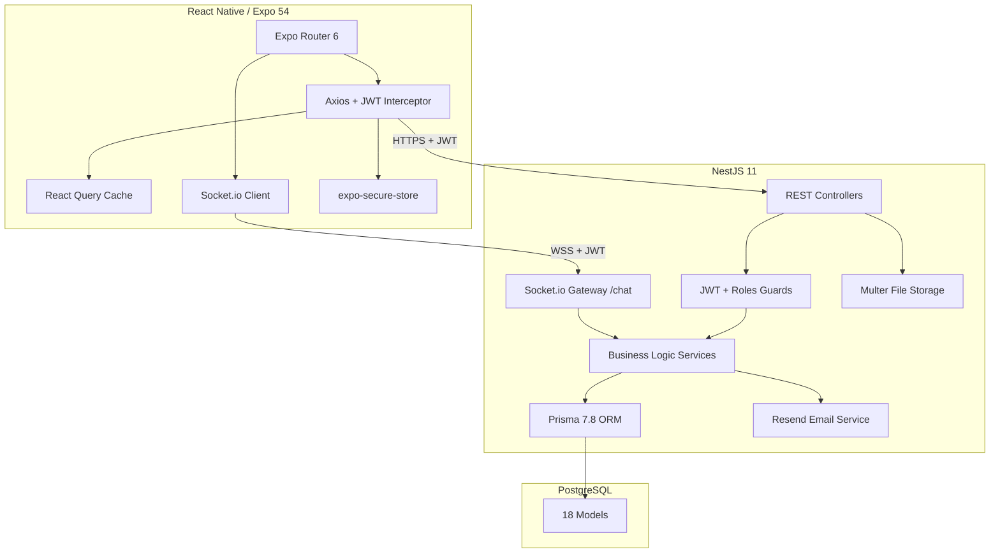
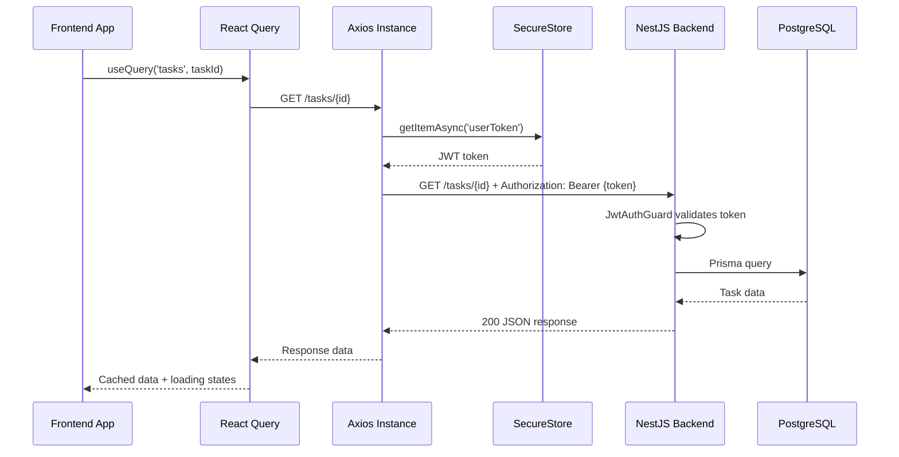
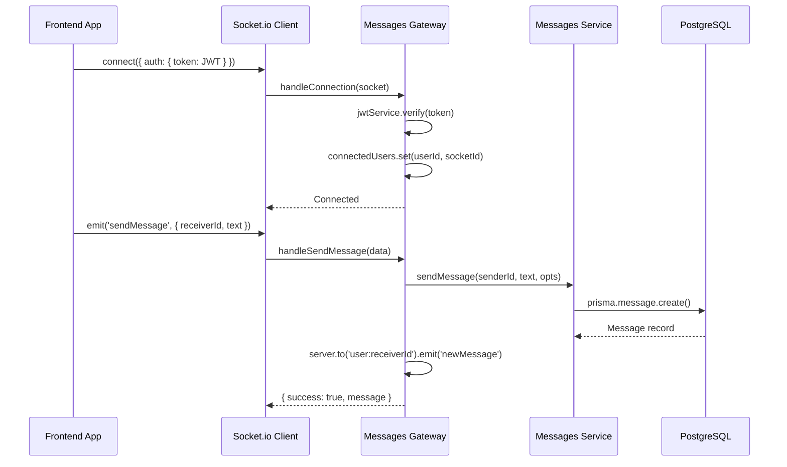
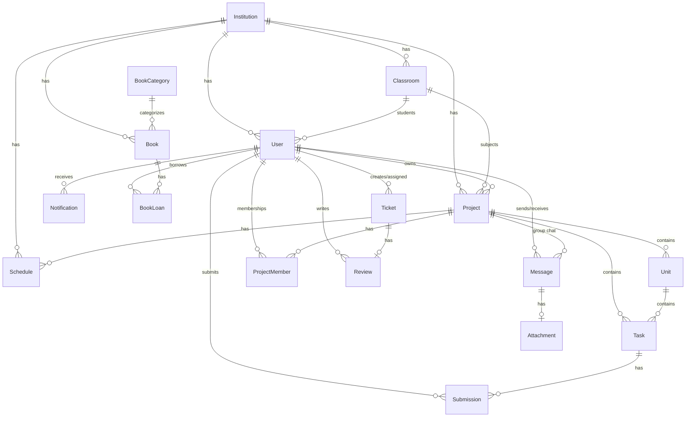
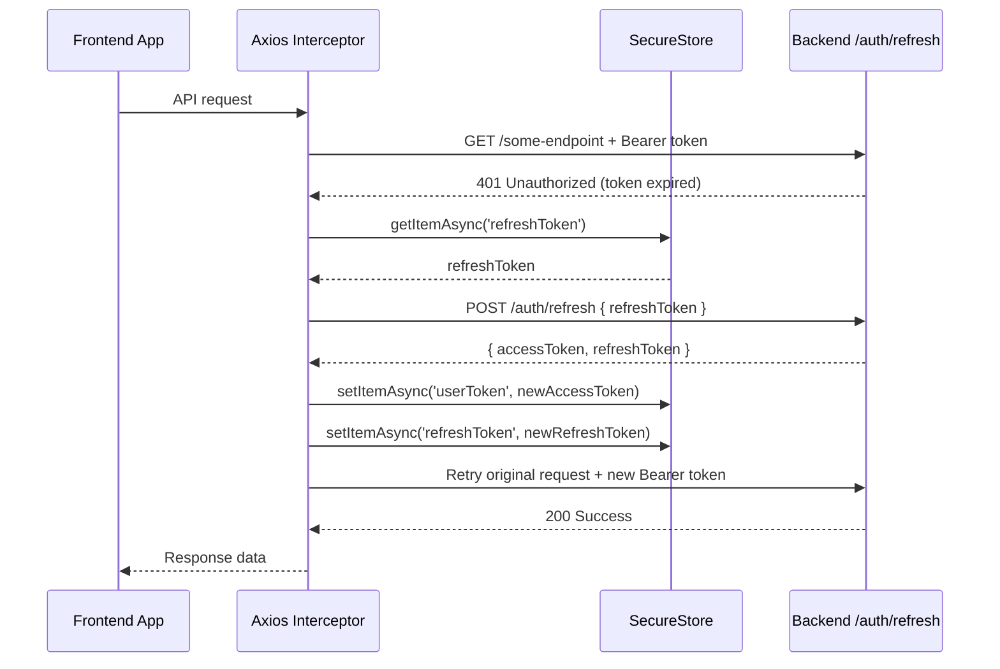
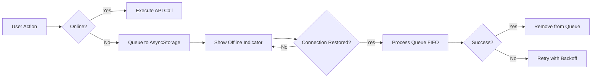
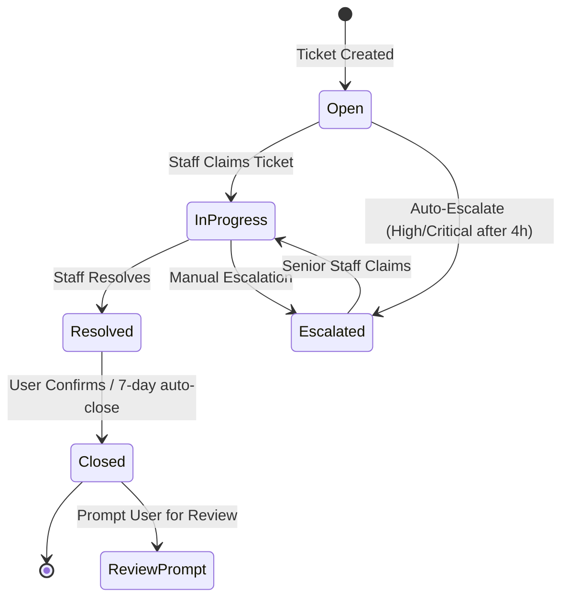

# Design Document: Homework App Integration

## Overview

This design addresses the complete integration of the Homework educational platform, bridging the gap between a React Native/Expo 54 frontend and a NestJS 11 backend. The core problem: only 4 of ~30+ screens use real API data, with the rest relying on mock data, simulated submissions, and hardcoded values.

The integration spans 6 major workstreams:
1. **Mock Data Elimination** — Replace `MOCK_SUBJECTS`, `MOCK_UNITS`, `MOCK_STUDENTS`, `MOCK_UNIT_TASKS`, `MOCK_GRADES`, and `setTimeout()` submission simulation with real API calls
2. **Real-Time Communication** — Connect the frontend to the existing Socket.io WebSocket gateway for chat and notification push
3. **Missing Backend Endpoints** — Implement 14 missing endpoints (PUT/DELETE institutions, PUT/DELETE subjects, teacher-specific routes, etc.)
4. **Frontend Screen Integration** — Wire library, calendar, admin, support, and teacher dashboard screens to their backend counterparts
5. **Cross-Cutting Concerns** — File upload, validation, caching, offline support, error handling
6. **Role-Based Access & Multi-Tenancy** — Enforce hierarchical permissions (SUPER_ADMIN > SCHOOL_ADMIN > TEACHER > STUDENT > SUPPORT) across all features

### Key Design Decisions

- **No new ORM or framework** — All backend work stays within NestJS/Prisma; all frontend work stays within Expo Router/axios
- **Subjects = Projects within Classrooms** — The existing `Project` model serves as "Subject" when linked to a `Classroom`. No schema migration needed for this mapping.
- **React Query for caching** — Introduce `@tanstack/react-query` for frontend data fetching, caching, and optimistic updates
- **Socket.io client** — Use `socket.io-client` on the frontend to connect to the existing `/chat` namespace gateway
- **Incremental rollout** — Mock data removal happens screen-by-screen; each screen gets proper empty/error states before mock removal

## Architecture

### System Architecture



### Request Flow



### WebSocket Connection Flow



## Components and Interfaces

### Backend: New Endpoints to Implement

| Endpoint | Method | Module | Guard Roles | Description |
|---|---|---|---|---|
| `/institutions/{id}` | PUT | Institutions | SUPER_ADMIN, SCHOOL_ADMIN | Update institution details |
| `/institutions/{id}` | DELETE | Institutions | SUPER_ADMIN | Soft-delete institution |
| `/institutions/{id}/admins` | POST | Institutions | SUPER_ADMIN | Assign SCHOOL_ADMIN role |
| `/institutions/{id}/admins/{adminId}` | DELETE | Institutions | SUPER_ADMIN | Remove SCHOOL_ADMIN role |
| `/subjects/{id}` | PUT | Subjects | TEACHER, SCHOOL_ADMIN | Update subject details |
| `/subjects/{id}` | DELETE | Subjects | SCHOOL_ADMIN | Delete subject with cascade |
| `/teachers/{id}/students` | GET | Users | SUPER_ADMIN, SCHOOL_ADMIN, TEACHER | Distinct student list for teacher |
| `/teachers/{id}/subjects` | GET | Users | SUPER_ADMIN, SCHOOL_ADMIN, TEACHER | Teacher's assigned subjects |
| `/users/{id}/tickets` | GET | Users | All authenticated | User's ticket history |
| `/reviews/{id}` | GET | Reviews | All authenticated | Individual review details |
| `/units/{unitId}/tasks` | GET | Tasks | All authenticated | Tasks within a unit |
| `/tasks/calendar` | GET | Tasks | All authenticated | Tasks mapped by date range |
| `/messages/{id}/history` | DELETE | Messages | All authenticated | Soft-delete chat history |
| `/subjects/chats` | GET | Subjects | All authenticated | Subject-based group chat list |

### Backend: Existing Endpoints (No Changes Needed)

Key existing endpoints that the frontend will integrate with:

- `POST /auth/login`, `GET /auth/profile`, `PATCH /auth/profile`, `PATCH /auth/change-password`
- `POST /auth/register`, `POST /auth/institutional-user`
- `GET /tasks/:id`, `GET /tasks/project/:projectId`, `POST /tasks`, `PATCH /tasks/:id`, `DELETE /tasks/:id`
- `POST /submissions`, `PATCH /submissions/:id/grade`, `GET /submissions/task/:taskId`
- `POST /uploads` (multipart/form-data, 50MB limit)
- `GET /messages/:collaboratorId`, `POST /messages/:targetId?type=user|project`, `GET /messages/project/:projectId`
- `GET /notifications`, `PATCH /notifications/mark-all-read`, `PATCH /notifications/:id/read`
- `GET /library/books`, `GET /library/categories`, `GET /library/books/:id`, `POST /library/books/:id/loan`, `PATCH /loans/:id/return`
- `GET /schedules`, `POST /schedules`, `DELETE /schedules/:id`
- `GET /classrooms/institution/:instId`, `POST /classrooms`, `GET /classrooms/:id`, `GET /classrooms/:id/subjects`
- `POST /subjects/classroom/:classId`, `GET /subjects/:id`, `GET /subjects/:id/tasks`, `GET /subjects/:id/stats`
- `GET /institutions`, `POST /institutions`, `GET /institutions/:id`, `GET /institutions/:id/stats`

### Frontend: New Service Layer

Introduce a service layer using React Query hooks organized by domain:

```
hooks/
  api/
    useAuth.ts          — login, profile, token refresh
    useTasks.ts         — task CRUD, calendar queries
    useSubmissions.ts   — submit, grade, fetch by task
    useProjects.ts      — project/subject listing
    useMessages.ts      — chat history, send message
    useNotifications.ts — notification CRUD, real-time push
    useLibrary.ts       — books, categories, loans
    useSchedules.ts     — schedule CRUD
    useInstitutions.ts  — institution management
    useClassrooms.ts    — classroom management
    useUsers.ts         — user management, teacher endpoints
    useTickets.ts       — support ticket CRUD
    useReviews.ts       — review CRUD, stats
    useUploads.ts       — file upload with progress
```

### Frontend: Socket.io Integration Module

```typescript
// utils/socket.ts
interface SocketManager {
  connect(token: string): void;
  disconnect(): void;
  onNewMessage(callback: (msg: Message) => void): void;
  onNewNotification(callback: (notif: Notification) => void): void;
  sendMessage(data: { receiverId?: string; projectId?: string; text: string }): void;
  joinProject(projectId: string): void;
  emitTyping(target: { receiverId?: string; projectId?: string }): void;
}
```

The socket manager connects to the existing `/chat` namespace with JWT auth from SecureStore. It integrates with React Query's cache to invalidate message and notification queries on real-time events.

### Frontend: Screen Integration Map

| Screen | Current State | Target Integration |
|---|---|---|
| `tasks/[id].tsx` | Mock tasks + setTimeout | `GET /tasks/{id}` + `POST /submissions` + `POST /uploads` |
| `projects/index.tsx` | MOCK_SUBJECTS fallback | `GET /projects` only, proper empty/error states |
| `projects/[id]/index.tsx` | MOCK_UNITS + mock ID prefix | `GET /subjects/{id}` + `GET /subjects/{id}/tasks` |
| `projects/[id]/students.tsx` | MOCK_STUDENTS | `GET /teachers/{id}/students` (new endpoint) |
| `projects/[id]/unit/[unitId].tsx` | MOCK_UNIT_TASKS | `GET /units/{unitId}/tasks` (new endpoint) |
| `grades.tsx` | MOCK_GRADES | New grades aggregation endpoint or client-side from submissions |
| `chat/[id].tsx` | Unverified | Socket.io + `GET /messages/{id}` |
| `library.tsx` | Unverified | `GET /library/books` + `GET /library/categories` |
| `book/[id].tsx` | Unverified | `GET /library/books/{id}` + loan/return |
| `calendar.tsx` | Unverified | `GET /schedules` + `GET /tasks/calendar` (new) |
| `support.tsx` | Unverified | `POST /tickets` + `GET /tickets` |
| `admin/*` screens | Unverified | Institution/classroom/user management endpoints |


## Data Models

### Existing Prisma Models (No Schema Changes Required)

The current schema has 18 models that cover all required functionality. Key relationships:



### Key Model Details

**User** (roles: SUPER_ADMIN, SCHOOL_ADMIN, TEACHER, STUDENT, SUPPORT)
- Links to Institution via `institutionId`
- Links to Classroom via `classroomId` (for students)
- Profile fields: `specialty`, `bio`, `parentName`, `parentPhone`

**Project** (dual-purpose: personal project OR classroom subject)
- When `classroomId` is set → acts as a Subject within a Classroom
- When `classroomId` is null → acts as a personal Project
- `userId` = teacher/owner who created it

**Task** (within Project, optionally within Unit)
- Types: ASSIGNMENT, EXAM, NOTE, QUIZ
- Status: TODO, IN_PROGRESS, DONE
- `maxGrade` defaults to 100

**Submission** (unique per task+student)
- Status: SUBMITTED, GRADED, RETURNED
- `@@unique([taskId, studentId])` prevents duplicate submissions

**Message** (supports 1:1 and group chat)
- `receiverId` set → direct message
- `projectId` set → group/project message
- Optional `Attachment` with file metadata

**Notification** (types: PROJECT, TASK, ALERT, COLLABORATOR_REQUEST, COLLABORATOR_ACCEPTED, SUBMISSION_GRADED)

**Ticket** (support system)
- Status: OPEN, IN_PROGRESS, RESOLVED, CLOSED
- Links to assigned support staff and creator
- Optional Review after resolution

### New TypeScript Interfaces (Frontend)

```typescript
// types/submission.ts
interface Submission {
  id: string;
  taskId: string;
  studentId: string;
  fileUrl?: string;
  content?: string;
  grade?: number;
  feedback?: string;
  status: 'SUBMITTED' | 'GRADED' | 'RETURNED';
  createdAt: string;
  updatedAt: string;
  student?: { id: string; fullName: string; avatarUrl?: string };
}

// types/message.ts
interface ChatMessage {
  id: string;
  text: string;
  senderId: string;
  receiverId?: string;
  projectId?: string;
  attachment?: {
    id: string;
    fileName: string;
    fileUrl: string;
    mimeType: string;
    fileSize?: number;
  };
  createdAt: string;
  sender?: { id: string; fullName: string; avatarUrl?: string };
}

// types/library.ts
interface Book {
  id: string;
  title: string;
  author: string;
  synopsis?: string;
  location?: string;
  coverUrl?: string;
  available: boolean;
  categoryId: string;
  category?: { id: string; name: string };
  loans?: BookLoan[];
}

interface BookLoan {
  id: string;
  bookId: string;
  userId: string;
  loanDate: string;
  returnDate?: string;
  status: 'ACTIVE' | 'RETURNED' | 'OVERDUE';
}

// types/ticket.ts
interface Ticket {
  id: string;
  title: string;
  description: string;
  category: string;
  status: 'OPEN' | 'IN_PROGRESS' | 'RESOLVED' | 'CLOSED';
  assignedToId?: string;
  createdById: string;
  createdAt: string;
  updatedAt: string;
  review?: Review;
}

interface Review {
  id: string;
  rating: number; // 1-5
  comment?: string;
  ticketId: string;
  userId: string;
  createdAt: string;
}

// types/schedule.ts
interface Schedule {
  id: string;
  day: string;
  startTime: string;
  endTime: string;
  room?: string;
  projectId: string;
  institutionId: string;
  project?: { id: string; name: string; color?: string };
}

// types/institution.ts
interface Institution {
  id: string;
  name: string;
  logoUrl?: string;
  address?: string;
  _count?: {
    users: number;
    projects: number;
    classrooms: number;
  };
}

// types/classroom.ts
interface Classroom {
  id: string;
  name: string;
  description?: string;
  institutionId: string;
  _count?: {
    students: number;
    projects: number;
  };
}

// types/notification.ts
interface AppNotification {
  id: string;
  title: string;
  message: string;
  type: 'PROJECT' | 'TASK' | 'ALERT' | 'COLLABORATOR_REQUEST' | 'COLLABORATOR_ACCEPTED' | 'SUBMISSION_GRADED';
  read: boolean;
  userId: string;
  createdAt: string;
}
```

### API Response Contracts for New Endpoints

**GET /teachers/{id}/students**
```json
{
  "data": [
    { "id": "uuid", "fullName": "string", "email": "string", "avatarUrl": "string|null", "classroomId": "uuid", "classroomName": "string" }
  ],
  "total": 45,
  "page": 1,
  "limit": 20
}
```

**GET /teachers/{id}/subjects**
```json
{
  "data": [
    { "id": "uuid", "name": "string", "classroomId": "uuid", "classroomName": "string", "studentCount": 30, "taskCount": 12, "avgGrade": 78.5 }
  ],
  "total": 5,
  "page": 1,
  "limit": 20
}
```

**GET /tasks/calendar?startDate=2025-01-01&endDate=2025-01-31**
```json
{
  "tasks": [
    { "id": "uuid", "title": "string", "dueDate": "2025-01-15T23:59:00Z", "status": "TODO", "projectName": "string", "projectColor": "#hex" }
  ]
}
```

**GET /units/{unitId}/tasks**
```json
{
  "data": [
    { "id": "uuid", "title": "string", "status": "TODO", "type": "ASSIGNMENT", "dueDate": "string|null", "maxGrade": 100, "submissionCount": 5 }
  ],
  "total": 8,
  "page": 1,
  "limit": 15
}
```


## Frontend Screen Designs

### Teacher Dashboard (`/teacher/dashboard`)

The teacher dashboard is the primary landing screen for TEACHER role users, aggregating data from multiple endpoints into a unified view.

**Data Sources:**
- `GET /auth/profile` — teacher identity and institution context
- `GET /teachers/{id}/subjects` — assigned subjects with stats
- `GET /teachers/{id}/students` — student roster summary
- `GET /submissions/task/{taskId}` — pending submissions (iterated per subject)
- `GET /tasks/calendar` — upcoming deadlines

**Component Structure:**

```
TeacherDashboard
├── DashboardHeader (teacher name, avatar, institution)
├── StatsRow
│   ├── StatTile (Total Students — from /teachers/{id}/students total)
│   ├── StatTile (Active Subjects — from /teachers/{id}/subjects total)
│   ├── StatTile (Pending Grading — aggregated pending submission count)
│   └── StatTile (Avg Performance — weighted avgGrade across subjects)
├── QuickActions
│   ├── ActionTile → navigate('/tasks/create')
│   ├── ActionTile → navigate('/grades')
│   ├── ActionTile → navigate('/submissions/pending')
│   └── ActionTile → navigate('/reports')
├── SubjectsList (horizontal scroll)
│   └── SubjectCard (name, classroom, studentCount, taskCount, avgGrade)
├── PendingSubmissions (vertical list, max 5)
│   └── SubmissionRow (student name, task title, submitted date, action button)
└── UpcomingDeadlines (vertical list, max 5)
    └── DeadlineRow (task title, subject, dueDate, countdown)
```

**Teacher Analytics Charts (Req 3.12):**

Chart library: `react-native-chart-kit` (lightweight, Expo-compatible, supports bar/line/pie charts).

| Chart | Type | Data Source | Description |
|---|---|---|---|
| Grade Distribution | Bar chart | Submissions per subject | Histogram of grade ranges (0-20, 21-40, …, 81-100) |
| Progress Trends | Line chart | Submissions over time | Weekly submission count + avg grade trend line |
| Subject Comparison | Horizontal bar | `/teachers/{id}/subjects` | Side-by-side avgGrade per subject |

Charts render inside a `PerformanceAnalytics` component accessible from the dashboard via a "View Analytics" action tile.

**Teacher Calendar Integration (Req 3.13):**

The teacher calendar merges two data sources:
1. `GET /schedules` — recurring class schedule (day, startTime, endTime, room, subject)
2. `GET /tasks/calendar?startDate=X&endDate=Y` — task deadlines for teacher's subjects

Both are fetched via React Query and merged client-side into a unified `CalendarEvent[]` array rendered in the shared `CalendarScreen` component with color-coded event types.

**Grading Statistics Display (Req 3.10):**

The `GradingStatsCard` component appears on both the teacher dashboard and individual subject detail screens:

```typescript
interface GradingStats {
  averageGrade: number;       // weighted avg from submissions
  completionRate: number;     // (graded + returned) / total submissions
  pendingCount: number;       // submissions with status === 'SUBMITTED'
  totalSubmissions: number;
}
```

Computed client-side from `GET /submissions/task/{taskId}` responses aggregated across tasks in a subject. Displayed as a 4-cell grid with circular progress indicators for rates and numeric values for counts.

**Attendance Tracking Limitation (Req 3.14):**

The backend currently returns hardcoded attendance strings ("95%", "98%"). No `Attendance` model or tracking endpoint exists. The design acknowledges this gap:
- **Current workaround:** Display the hardcoded value with a "(estimated)" label
- **Future solution:** Introduce an `Attendance` Prisma model (`userId`, `date`, `status: PRESENT|ABSENT|LATE`, `classroomId`) with `POST /attendance` and `GET /attendance?userId=X&dateRange=Y` endpoints. This is out of scope for the current integration but the teacher dashboard layout reserves space for a real attendance widget.

### Admin Dashboard (`/admin/dashboard`)

**Data Sources:**
- `GET /institutions` (SUPER_ADMIN) or `GET /institutions/{id}/stats` (SCHOOL_ADMIN)
- `GET /users?role=X` — user counts by role
- `GET /tickets?status=OPEN` — pending support tickets count
- Institutional metrics from `/institutions/{id}/stats`

**Component Structure:**

```
AdminDashboard
├── DashboardHeader (admin name, role badge, institution selector for SUPER_ADMIN)
├── StatsGrid (2x3 grid)
│   ├── StatCard (Total Users — by role breakdown)
│   ├── StatCard (Active Institutions — count)
│   ├── StatCard (Classrooms — count)
│   ├── StatCard (Task Completion Rate — percentage)
│   ├── StatCard (Open Tickets — badge with count)
│   └── StatCard (Avg Grade — institution-wide)
├── QuickNavTiles
│   ├── NavTile → /admin/users (badge: new registrations)
│   ├── NavTile → /admin/institutions
│   ├── NavTile → /admin/tickets (badge: open count)
│   └── NavTile → /admin/reports
├── ActivityFeed (recent events, max 10)
│   └── ActivityRow (icon, description, timestamp, user attribution)
├── AlertsBanner (system issues, overdue tasks, pending actions)
└── AnalyticsPreview
    ├── EnrollmentTrendChart (line chart, last 6 months)
    └── GradeDistributionChart (bar chart, institution-wide)
```

**Role-Based Data Scoping:**
- SUPER_ADMIN: Institution selector dropdown at top; stats aggregate across selected or all institutions
- SCHOOL_ADMIN: Fixed to own institution; no selector shown

### Support Dashboard (`/support/dashboard`)

**Data Sources:**
- `GET /users/{id}/tickets` — assigned ticket queue (requires endpoint completion per Req 17.9)
- `GET /tickets?status=OPEN&assignedTo={userId}` — personal queue
- `GET /users/{id}/reviews` — satisfaction metrics

**Component Structure:**

```
SupportDashboard
├── DashboardHeader (support staff name, shift status)
├── KPIRow
│   ├── KPITile (Resolved Today — count)
│   ├── KPITile (Avg Response Time — minutes)
│   ├── KPITile (Queue Length — pending tickets)
│   └── KPITile (Satisfaction Rating — from reviews avg)
├── TicketQueue (scrollable list, sorted by priority then date)
│   └── TicketRow (tracking #, title, category badge, priority indicator, created date)
├── EscalatedTickets (filtered list, high/critical priority)
│   └── TicketRow (same as above with escalation indicator)
└── PerformanceChart (bar chart: tickets resolved per day, last 7 days)
```

### Institution Management Screens

**Institution List (`/admin/institutions`):**
- Fetches `GET /institutions` with search query param
- Renders `InstitutionCard` grid: logo, name, address, user/classroom counts from `_count`
- FAB button for "Create Institution" → modal with name, address, logo upload via `POST /institutions`

**Institution Detail (`/admin/institution/{id}`):**
- Fetches `GET /institutions/{id}` + `GET /institutions/{id}/stats`
- Tabs: Overview | Classrooms | Users | Settings
- Overview: stats cards (students, teachers, classrooms, avg grades), quick action buttons
- Classrooms tab: `GET /classrooms/institution/{id}` → classroom cards
- Users tab: `GET /users?institutionId={id}` → user list with role filters
- Settings tab: edit form using `PUT /institutions/{id}` (new endpoint), admin assignment via `POST /institutions/{id}/admins`

**Logo Upload Flow (Req 11.2):**
1. User taps logo placeholder in institution create/edit form
2. `expo-image-picker` opens camera roll
3. Selected image uploaded via `POST /uploads` (multipart/form-data)
4. Returned `fileUrl` set as `logoUrl` field in institution create/update payload

**Admin Assignment UI (Req 11.7):**
- Within institution settings, "Manage Admins" section lists current SCHOOL_ADMIN users
- "Add Admin" button opens user search modal (searches `GET /users?institutionId={id}&role=TEACHER|STUDENT`)
- Selection triggers `POST /institutions/{id}/admins` with userId
- Remove button triggers `DELETE /institutions/{id}/admins/{adminId}` with confirmation dialog

**Institutional Metrics Visualization (Req 11.8):**
- Enrollment trend line chart (monthly new users over 12 months)
- Activity heatmap (submissions per day of week)
- Performance comparison bar chart (avg grade per classroom)
- All rendered using `react-native-chart-kit` within the institution detail Overview tab

### Classroom Management Screens

**Classroom List (`/admin/institution/{id}/classrooms`):**
- Fetches `GET /classrooms/institution/{id}`
- Renders classroom cards with name, description, student count, subject count
- "Create Classroom" button → `/admin/institution/{id}/create-classroom`

**Classroom Create (`/admin/institution/{id}/create-classroom`):**
- Form fields: name (required), description, teacher assignment (searchable dropdown from `GET /users?institutionId={id}&role=TEACHER`)
- Submit via `POST /classrooms` with `institutionId` from route params
- On success, navigate to classroom detail

**Classroom Detail (`/admin/institution/{id}/classroom/{classId}`):**
- Fetches `GET /classrooms/{classId}` + `GET /classrooms/{classId}/subjects`
- Tabs: Subjects | Students | Schedule
- Subjects tab: subject cards with avgGrade, taskCount; "Add Subject" button → `/add-subject` screen
- Students tab: student list with enrollment management
- Schedule tab: weekly timetable from `GET /schedules?classroomId={classId}` with conflict detection

**Subject Addition Within Classroom (Req 12.6):**
- `/admin/institution/{id}/classroom/{classId}/add-subject` screen
- Form: subject name, assigned teacher (dropdown), description, grading criteria
- Submit via `POST /subjects/classroom/{classId}`

**Schedule Integration (Req 12.8):**
- Schedule tab within classroom detail shows weekly grid
- Each cell: day × time slot → schedule entry with subject name, room
- "Add Schedule" modal: day picker, time range, subject selector, room field
- Submit via `POST /schedules` with `institutionId` and `projectId` (subject)
- Conflict detection: client-side check against existing entries before submission

### Subject Management Screens

**Subject Detail (`/admin/institution/{id}/classroom/{classId}/subject/{subjectId}`):**
- Fetches `GET /subjects/{subjectId}` + `GET /subjects/{subjectId}/stats` + `GET /subjects/{subjectId}/tasks`
- Header: subject name, teacher name, classroom name
- Stats row: avgGrade, totalTasks, submittedTasks, studentCount (from `/stats`)
- Recent submissions list with status badges (Graded/Pending)
- Task listing with filters (by unit, by status, by type)

**Subject Edit Flow (Req 13.7):**
- `/admin/institution/{id}/classroom/{classId}/subject/{subjectId}/edit` screen
- Pre-populated form from `GET /subjects/{subjectId}`
- Editable fields: name, description, teacher reassignment, grading scale
- Submit via `PUT /subjects/{subjectId}` (new endpoint)
- On success, invalidate React Query cache for subject detail and classroom subjects

**Unit System Integration (Req 13.6):**
- Within subject detail, "Units" section lists pedagogical units from `GET /subjects/{subjectId}` response
- Each unit card shows: name, task count, completion percentage
- Tapping a unit navigates to `/projects/{subjectId}/unit/{unitId}` which fetches `GET /units/{unitId}/tasks`
- "Create Unit" button within subject detail for teachers

### User Management Screens

**User List (`/admin/users`):**
- Fetches `GET /users` with query params: `role`, `institutionId`, `search`, `page`, `limit`
- Filter bar: role dropdown (ALL, STUDENT, TEACHER, SUPPORT, SCHOOL_ADMIN), institution dropdown (SUPER_ADMIN only), search text input
- User rows: avatar, fullName, email, role badge, institution name, last login
- Bulk operations toolbar (appears on multi-select): activate/deactivate, batch role change, export CSV

**CSV Import for Bulk Enrollment (Req 6.6):**

```
CSVImportFlow
1. User taps "Import CSV" button on user list or enrollment screen
2. expo-document-picker opens file selector (filter: .csv)
3. Client-side parsing via papaparse library:
   - Validate required columns: fullName, email, role
   - Optional columns: classroomId, institutionId, parentName, parentPhone
   - Detect duplicates against existing users (email match)
4. Preview table shows parsed rows with validation status per row
5. User confirms → sequential POST /auth/register calls (batched, 10 concurrent)
6. Progress bar shows completion; error rows collected for retry
7. Summary: X created, Y skipped (duplicate), Z failed (with error details)
```

**Role-Specific Detail Screen Routing (Req 6.8):**

```typescript
// Navigation logic in user list onPress handler
function navigateToUserDetail(user: User) {
  const base = `/admin/institution/${user.institutionId}`;
  switch (user.role) {
    case 'STUDENT':  router.push(`${base}/student/${user.id}`);  break;
    case 'TEACHER':  router.push(`${base}/teacher/${user.id}`);  break;
    case 'SUPPORT':  router.push(`${base}/support/${user.id}`);  break;
    default:         router.push(`/admin/users/${user.id}`);      break;
  }
}
```

## Authentication & Authorization Design

### Token Refresh Flow (Req 7.2)



**Implementation in Axios interceptor:**
- On 401 response, check if a refresh is already in progress (prevent concurrent refreshes via a `isRefreshing` flag and a `failedQueue` array)
- If refresh succeeds, replay all queued requests with the new token
- If refresh fails (refresh token also expired), clear all tokens from SecureStore and navigate to `/auth/login` with a `sessionExpired=true` query param

### Session Timeout (Req 7.7)

- Track last user interaction timestamp in memory (touch events, navigation)
- `SessionTimeoutProvider` wraps the app root and runs a 60-second interval check
- If `now - lastInteraction > 25 minutes`, show a warning modal: "Your session will expire in 5 minutes. Tap to continue."
- If user taps "Continue", reset the timer
- If `now - lastInteraction > 30 minutes`, trigger automatic logout: clear SecureStore tokens, reset React Query cache, navigate to login
- Background state (app minimized) pauses the timer via `AppState` listener

### Role-Based Navigation Guards (Req 7.4)

**Route Protection Strategy:**

```typescript
// Role-to-route mapping
const ROUTE_PERMISSIONS: Record<string, UserRole[]> = {
  '/admin/dashboard':       ['SUPER_ADMIN', 'SCHOOL_ADMIN'],
  '/admin/institutions':    ['SUPER_ADMIN'],
  '/admin/users':           ['SUPER_ADMIN', 'SCHOOL_ADMIN'],
  '/admin/tickets':         ['SUPER_ADMIN', 'SCHOOL_ADMIN', 'SUPPORT'],
  '/teacher/dashboard':     ['TEACHER'],
  '/support/dashboard':     ['SUPPORT'],
  // Student and shared routes accessible to all authenticated users
};
```

- `useRouteGuard()` hook checks current user role against `ROUTE_PERMISSIONS` on every navigation
- Unauthorized access redirects to the user's default home screen with a toast message
- Tab bar dynamically hides tabs not permitted for the current role (e.g., students don't see "Admin" tab)
- Within screens, conditional rendering hides action buttons (e.g., "Grade" button only visible to TEACHER on submission screens)

### Institutional Context Switching (Req 7.6)

For SUPER_ADMIN users who manage multiple institutions:

- `InstitutionContext` React context stores the currently selected `institutionId`
- Institution selector dropdown in admin dashboard header and admin screens
- Changing institution:
  1. Updates `InstitutionContext` value
  2. Invalidates all React Query caches scoped to institution data
  3. Refetches dashboard stats, user lists, classroom lists for the new institution
- All API calls from admin screens include `institutionId` from context as a query parameter
- SCHOOL_ADMIN users have their `institutionId` fixed from their profile; no selector shown

## File Management Design

### File Upload with Progress Tracking (Req 8.2)

```typescript
// hooks/api/useUploads.ts
function useFileUpload() {
  const [progress, setProgress] = useState(0);
  const [status, setStatus] = useState<'idle' | 'uploading' | 'success' | 'error'>('idle');

  const upload = async (file: DocumentPickerAsset) => {
    const formData = new FormData();
    formData.append('file', {
      uri: file.uri,
      name: file.name,
      type: file.mimeType,
    } as any);

    setStatus('uploading');
    const response = await api.post('/uploads', formData, {
      headers: { 'Content-Type': 'multipart/form-data' },
      onUploadProgress: (event) => {
        const pct = Math.round((event.loaded * 100) / (event.total ?? 1));
        setProgress(pct);
      },
    });
    setStatus('success');
    return response.data; // { fileUrl, fileName, mimeType, fileSize }
  };

  return { upload, progress, status };
}
```

**UI Component:** `UploadProgressBar` renders a horizontal progress bar with percentage text and estimated time remaining (calculated from upload speed over last 2 seconds). Displayed inline within submission forms and chat attachment flows.

**File Validation (client-side before upload):**
- Max size: 50MB (matches backend Multer config)
- Allowed types: images (jpg, png, gif), documents (pdf, doc, docx, xls, xlsx, ppt, pptx), videos (mp4, mov)
- Validation runs before FormData creation; rejected files show inline error with reason

### File Preview and Download (Req 8.3, 8.4)

**Preview Strategy by MIME type:**

| MIME Type | Preview Component | Behavior |
|---|---|---|
| `image/*` | `ImagePreview` | Thumbnail in list; tap opens full-screen `expo-image` viewer with zoom/pan |
| `video/*` | `VideoPreview` | Play icon overlay on thumbnail; tap opens `expo-av` video player |
| `application/pdf` | `PDFPreview` | PDF icon with filename; tap opens in-app via `expo-web-browser` or system PDF viewer |
| Other documents | `FileIcon` | Generic file icon with extension label; tap triggers download |

**Download Flow:**
1. Tap download button on file attachment
2. `expo-file-system.downloadAsync(fileUrl, localPath)` with progress callback
3. Progress shown in download indicator
4. On completion, `expo-sharing.shareAsync(localPath)` opens system share sheet (save to files, open in app)
5. Authentication: download URL includes short-lived token param or uses authenticated axios request piped to file system

### File Versioning for Submissions (Req 8.7)

- Students can resubmit before the task deadline
- Each resubmission creates a new `Submission` record (the `@@unique([taskId, studentId])` constraint means the backend must handle upsert or allow multiple submissions with a `version` field)
- **Design decision:** Use `PATCH /submissions/{id}` to update the existing submission's `fileUrl` and `content`, preserving the original `createdAt` and updating `updatedAt`
- The backend stores previous file URLs in an audit log or the file storage retains old versions by path convention (`/uploads/{taskId}/{studentId}/v1.pdf`, `/uploads/{taskId}/{studentId}/v2.pdf`)
- Teachers see submission history via `GET /submissions/task/{taskId}?studentId={id}` which returns all versions sorted by `updatedAt`

### File Organization by Context (Req 8.6)

Files are organized by their upload context using path conventions in the storage backend:

```
/uploads/
  /tasks/{taskId}/resources/       — teacher-uploaded task resources
  /tasks/{taskId}/submissions/{studentId}/  — student submission files
  /messages/{messageId}/           — chat attachment files
  /institutions/{instId}/logo/     — institution logos
  /users/{userId}/avatar/          — user profile avatars
```

The frontend displays files grouped by context in the `files/[id].tsx` screen, fetching file metadata from the relevant parent entity (task, message, institution).

## Validation & Error Handling Design

### Validation Strategy (Req 9.1)

**Library choice:** `zod` for schema-based validation. Zod schemas mirror backend DTO validation rules and are shared across all form screens.

```typescript
// validation/schemas.ts
import { z } from 'zod';

export const taskSchema = z.object({
  title: z.string().min(1, 'Title is required').max(200),
  description: z.string().optional(),
  dueDate: z.string().datetime().optional(),
  maxGrade: z.number().min(0).max(100).default(100),
  type: z.enum(['ASSIGNMENT', 'EXAM', 'NOTE', 'QUIZ']),
});

export const institutionSchema = z.object({
  name: z.string().min(2, 'Name must be at least 2 characters').max(100),
  address: z.string().optional(),
  logoUrl: z.string().url().optional(),
});

export const ticketSchema = z.object({
  title: z.string().min(5, 'Title must be at least 5 characters').max(200),
  description: z.string().min(10, 'Please provide more detail'),
  category: z.enum(['Technical', 'Academic', 'Account', 'General']),
  priority: z.enum(['Low', 'Medium', 'High', 'Critical']),
});
```

**Pattern:** Each form screen uses a `useForm()` hook (custom, lightweight) that accepts a Zod schema. Field-level validation runs on blur; form-level validation runs on submit. Error messages display below each field with red highlight styling.

### Error Categorization (Req 9.3)

```typescript
// utils/errorHandler.ts
interface CategorizedError {
  category: 'network' | 'timeout' | 'auth' | 'permission' | 'server' | 'validation' | 'unknown';
  userMessage: string;
  retryable: boolean;
  action: 'retry' | 'login' | 'back' | 'contact_support' | 'fix_input';
}

function categorizeError(error: AxiosError): CategorizedError {
  if (!error.response) {
    return error.code === 'ECONNABORTED'
      ? { category: 'timeout', userMessage: 'Request timed out. Check your connection.', retryable: true, action: 'retry' }
      : { category: 'network', userMessage: 'No internet connection.', retryable: true, action: 'retry' };
  }
  switch (error.response.status) {
    case 401: return { category: 'auth', userMessage: 'Session expired. Please log in again.', retryable: false, action: 'login' };
    case 403: return { category: 'permission', userMessage: 'You don\'t have permission for this action.', retryable: false, action: 'back' };
    case 422: return { category: 'validation', userMessage: 'Please check your input.', retryable: false, action: 'fix_input' };
    default:  return { category: 'server', userMessage: 'Something went wrong. Try again later.', retryable: true, action: 'retry' };
  }
}
```

**Error Display:** A global `ErrorBoundary` catches unhandled errors. For API errors, each screen uses the categorized error to render an `ErrorState` component with the user message, an icon matching the category, and an action button (Retry, Go Back, Login, Contact Support).

### Retry Mechanism with Exponential Backoff (Req 9.4)

```typescript
// utils/retry.ts
async function withRetry<T>(
  fn: () => Promise<T>,
  options: { maxRetries: number; baseDelay: number; maxDelay: number } = { maxRetries: 3, baseDelay: 1000, maxDelay: 10000 }
): Promise<T> {
  for (let attempt = 0; attempt <= options.maxRetries; attempt++) {
    try {
      return await fn();
    } catch (error) {
      if (attempt === options.maxRetries || !categorizeError(error).retryable) throw error;
      const delay = Math.min(options.baseDelay * Math.pow(2, attempt) + Math.random() * 500, options.maxDelay);
      await new Promise(resolve => setTimeout(resolve, delay));
    }
  }
  throw new Error('Unreachable');
}
```

React Query is configured with `retry: 3` and `retryDelay: (attempt) => Math.min(1000 * 2 ** attempt, 10000)` as global defaults. Manual retry buttons on error states call `queryClient.invalidateQueries()` for the failed query key.

### Form State Preservation (Req 9.7)

- Form state is managed via `useRef` + `useState` (not URL params) so it survives error-triggered re-renders
- On API submission failure, the form remains populated with all entered data; only the error message updates
- For multi-step forms (e.g., institution creation), each step's data is stored in a `useReducer` state that persists across step navigation
- If the user navigates away from a dirty form, a confirmation dialog warns about unsaved changes (using `usePreventRemove` from Expo Router)
- Draft auto-save: for long forms (ticket creation, task creation), form state is periodically saved to `AsyncStorage` with a `draft:{formType}:{entityId}` key and restored on screen mount

## Performance & Offline Design

### Pagination Strategy (Req 10.2)

All list endpoints use cursor-based or offset pagination with configurable page sizes:

| Data Type | Page Size | Endpoint | Pagination Style |
|---|---|---|---|
| User lists | 20 | `GET /users?page=X&limit=20` | Offset |
| Task lists | 15 | `GET /tasks/project/{id}?page=X&limit=15` | Offset |
| Message history | 50 | `GET /messages/{id}?page=X&limit=50` | Offset (reverse chronological) |
| Book catalog | 20 | `GET /library/books?page=X&limit=20` | Offset |
| Notifications | 20 | `GET /notifications?page=X&limit=20` | Offset |
| Submissions | 15 | `GET /submissions/task/{id}?page=X&limit=15` | Offset |

**Frontend Implementation:** React Query's `useInfiniteQuery` with `getNextPageParam` extracting the next page number from response metadata. `FlatList` with `onEndReached` triggers `fetchNextPage()`. A "Load more" footer indicator shows during page fetches.

### Offline Queue Design (Req 10.3)



**Queue Structure:**
```typescript
interface QueuedAction {
  id: string;
  type: 'SUBMIT_TASK' | 'SEND_MESSAGE' | 'GRADE_SUBMISSION' | 'CREATE_TICKET';
  payload: Record<string, unknown>;
  endpoint: string;
  method: 'POST' | 'PATCH' | 'PUT';
  createdAt: string;
  retryCount: number;
}
```

- Actions queued to `AsyncStorage` under key `offline_queue`
- `NetInfo` listener from `@react-native-community/netinfo` detects connectivity changes
- On reconnection, queue processor runs sequentially (FIFO) to preserve action order
- Conflicting actions (e.g., two edits to same entity) resolved by last-write-wins
- UI shows pending action count badge and allows manual queue inspection

### Image Optimization (Req 10.6)

- **Upload optimization:** Before uploading, images are resized using `expo-image-manipulator`:
  - Profile avatars: max 200x200px, JPEG quality 0.7
  - Chat attachments: max 1200px longest side, JPEG quality 0.8
  - Task resources: original size preserved (teacher decision)
- **Display optimization:** `expo-image` (replacement for `<Image>`) with:
  - Progressive loading (blur placeholder → full image)
  - Memory-based caching (LRU, 100MB limit)
  - Disk caching for frequently accessed images (avatars, logos)
  - `contentFit="cover"` for thumbnails, `contentFit="contain"` for full-screen viewers

### Background Sync (Req 10.7)

- `expo-background-fetch` registers a periodic task (minimum interval: 15 minutes, OS-controlled)
- Background task performs:
  1. Process offline queue if items exist
  2. Prefetch updated notification count via `GET /notifications?unreadOnly=true&limit=1`
  3. Sync read status for notifications marked read offline
- Foreground sync: on app resume (`AppState` change to 'active'), immediately run sync cycle
- Non-critical operations (analytics events, notification read status) are batched and sent in background sync rather than individual API calls

## Analytics & Visualization Design

### Chart Library Choice (Req 14.6)

**Selected library:** `react-native-chart-kit`

**Rationale:**
- Pure JS implementation, no native module linking required (Expo-compatible)
- Supports bar, line, pie, and progress charts
- Responsive sizing with `Dimensions.get('window').width`
- Customizable colors, labels, and grid lines
- Lightweight (~50KB bundle impact)

**Alternative considered:** `victory-native` — more powerful but heavier and requires `react-native-svg` which adds complexity. Reserved for future if chart requirements grow beyond `react-native-chart-kit` capabilities.

### Dashboard Layouts

**Admin Dashboard Analytics Panel:**

```
AnalyticsPanel
├── DateRangeSelector (preset: 7d, 30d, 90d, custom)
├── ChartRow
│   ├── EnrollmentTrendChart (line — new users per month)
│   └── ActivityChart (line — daily active users)
├── ChartRow
│   ├── GradeDistributionChart (bar — grade ranges across institution)
│   └── TaskCompletionChart (pie — TODO/IN_PROGRESS/DONE percentages)
├── KPICards
│   ├── AvgResponseTime (support tickets)
│   ├── SubmissionRate (submissions / total students × tasks)
│   └── EngagementScore (composite metric)
└── ExportButton → triggers report generation
```

**Teacher Analytics Panel:**

```
TeacherAnalyticsPanel
├── SubjectSelector (dropdown — filter charts by subject or "All")
├── GradeDistributionChart (bar — per selected subject)
├── ProgressTrendChart (line — weekly avg grade over semester)
├── SubjectComparisonChart (horizontal bar — avgGrade per subject)
└── StudentPerformanceTable (sortable — name, avgGrade, submissionRate, trend arrow)
```

### Data Export Design (Req 14.9)

**Export Formats:**

| Format | Library | Use Case |
|---|---|---|
| CSV | `papaparse` (stringify mode) | Raw data export for spreadsheets |
| Excel | `xlsx` (SheetJS) | Formatted reports with multiple sheets |
| PDF | `expo-print` + `expo-sharing` | Printable reports with charts as images |

**Export Flow:**
1. User selects export format from dropdown on report/analytics screen
2. Frontend assembles data from React Query cache (no additional API call if data is fresh)
3. For PDF: render an HTML template with inline chart images (captured via `react-native-view-shot`), pass to `expo-print` for PDF generation
4. For CSV/Excel: serialize data arrays via `papaparse`/`xlsx`, write to temp file via `expo-file-system`
5. `expo-sharing.shareAsync(filePath)` opens system share sheet for save/send

### Customizable Widgets (Req 14.10)

- Admin dashboard supports widget reordering via drag-and-drop (`react-native-draggable-flatlist`)
- Widget configuration stored in `AsyncStorage` under key `dashboard_layout:{userId}`
- Available widgets: StatsGrid, EnrollmentChart, GradeDistribution, ActivityFeed, TicketQueue, TaskCompletion, RecentSubmissions
- Default layout provided per role; user customizations override defaults
- "Reset to Default" button restores role-based default layout

## Support System Design

### Ticket Creation Form (Req 15.1)

**Screen:** `/support/create-ticket`

```
TicketCreationForm
├── CategoryPicker (segmented control: Technical | Academic | Account | General)
├── PriorityPicker (segmented control: Low | Medium | High | Critical)
├── TitleInput (text, validated by ticketSchema)
├── DescriptionInput (multiline text, min 10 chars)
├── AttachmentSection
│   ├── AttachButton → expo-document-picker
│   └── AttachmentPreview (thumbnail + remove button)
└── SubmitButton → POST /tickets
```

**On submit:** Validates via `ticketSchema` (Zod), uploads attachments via `POST /uploads` first, then creates ticket with `fileUrl` references. Displays confirmation with tracking number and expected response time based on priority.

### Support Dashboard Layout (`/support/dashboard`)

Covered in the Frontend Screen Designs section above. The support dashboard integrates:
- Personal ticket queue from `GET /users/{id}/tickets`
- Escalated tickets filtered by priority
- KPI tiles computed from ticket history and review data
- Performance chart showing resolution trends

### Ticket Escalation Workflow (Req 15.6, 15.7)



**Auto-escalation rules:**
- High priority tickets not claimed within 2 hours → escalated
- Critical priority tickets not claimed within 1 hour → escalated
- Any ticket unresolved after 48 hours → escalated
- Escalation triggers notification to SCHOOL_ADMIN and all SUPPORT staff

**Manual escalation:** Support staff can escalate via a button on the ticket detail screen, adding an escalation note. The ticket moves to the escalated queue visible to senior support staff and admins.

### Review Integration with Ticket Closure (Req 15.14)

- When a ticket status changes to CLOSED, the backend triggers a `SUBMISSION_GRADED`-type notification (repurposed) to the ticket creator
- The notification deep links to a review form screen: `/support/review/{ticketId}`
- Review form: 1-5 star rating, comment field, category-specific feedback toggles (Responsiveness, Technical Competence, Communication)
- Submit via `POST /reviews` with `ticketId` and `userId`
- If user doesn't review within 7 days, a reminder notification is sent; after 14 days, the review prompt expires
- Review data feeds into support staff KPI tiles and the admin support analytics dashboard

### Review Form Design (Req 16.1, 16.2)

**General User Review Form (`/admin/user/{userId}/create-review`):**

```
ReviewCreationForm
├── UserHeader (avatar, name, role, institution)
├── RatingDimensions
│   ├── StarRating (Academic — 1-5 stars)
│   ├── StarRating (Behavior — 1-5 stars)
│   ├── StarRating (Participation — 1-5 stars)
│   └── StarRating (Technical Skills — 1-5 stars)
├── OverallRating (computed average, displayed)
├── WrittenFeedback (multiline text)
├── ImprovementRecommendations (multiline text)
├── GoalSetting (optional, multiline text)
└── SubmitButton → POST /reviews
```

**Review Templates (Req 16.6):**
- Predefined templates loaded based on target user role:
  - Student evaluation: Academic, Behavior, Participation, Homework Completion
  - Teacher assessment: Teaching Quality, Communication, Curriculum Adherence, Student Engagement
- Templates stored as JSON in `constants/reviewTemplates.ts`
- Template selector dropdown at top of review form pre-fills dimension labels

**Review Confidentiality and Access Controls (Req 16.7):**
- Reviews have a `visibility` field: `PUBLIC` (visible to reviewed user), `CONFIDENTIAL` (admin-only)
- TEACHER reviews of students: default PUBLIC (student and parents can see)
- ADMIN reviews of teachers: default CONFIDENTIAL
- Access enforcement: `GET /users/{id}/reviews` filters by caller's role; students only see their own PUBLIC reviews
- Audit logging: all review access logged with viewer userId and timestamp

## Notification Deep Linking Design

### Notification-to-Screen Routing (Req 5.6)

```typescript
// utils/notificationRouter.ts
interface NotificationPayload {
  type: AppNotification['type'];
  entityId: string;       // ID of the related entity
  entityType: string;     // 'task' | 'message' | 'ticket' | 'submission' | 'project'
  metadata?: Record<string, string>; // additional routing context
}

function getDeepLinkRoute(payload: NotificationPayload): string {
  switch (payload.type) {
    case 'TASK':
      return `/tasks/${payload.entityId}`;
    case 'SUBMISSION_GRADED':
      return `/tasks/${payload.metadata?.taskId}`;
    case 'PROJECT':
      return `/projects/${payload.entityId}`;
    case 'COLLABORATOR_REQUEST':
    case 'COLLABORATOR_ACCEPTED':
      return `/collaborator/${payload.entityId}`;
    case 'ALERT':
      return payload.entityType === 'ticket'
        ? `/support/ticket/${payload.entityId}`
        : `/notifications`;
    default:
      return '/notifications';
  }
}
```

**Integration with notification tap:**
- `onNewNotification` callback from SocketManager stores notification in React Query cache
- When user taps a notification (from notification list or system push), `getDeepLinkRoute()` resolves the target screen
- `router.push(route)` navigates to the target; the target screen fetches fresh data via its own React Query hook
- For notifications received while app is in background: `expo-notifications` handles the tap event and passes the payload to `getDeepLinkRoute()` on app resume

### Badge Count Management (Req 5.2)

**Tab Badge Updates:**

```typescript
// hooks/useNotificationBadge.ts
function useNotificationBadge() {
  const { data: notifications } = useQuery({
    queryKey: ['notifications', 'unread'],
    queryFn: () => api.get('/notifications?unreadOnly=true&limit=1'),
    refetchInterval: 60000, // poll every 60s as fallback
  });

  // Real-time update via WebSocket
  useEffect(() => {
    socketManager.onNewNotification((notif) => {
      queryClient.setQueryData(['notifications', 'unread'], (old) => ({
        ...old,
        total: (old?.total ?? 0) + 1,
      }));
    });
  }, []);

  return notifications?.total ?? 0;
}
```

- Badge count displayed on the Notifications tab icon via Expo Router's `tabBarBadge` option
- Count decremented when user reads notifications (via `PATCH /notifications/{id}/read`)
- Count reset to 0 when user taps "Mark All Read" (via `PATCH /notifications/mark-all-read`)
- WebSocket `onNewNotification` event increments count in real-time without polling

### Notification Preferences (Req 5.5)

**New Endpoint:** `PUT /user/notification-preferences`

This endpoint is not in the existing backend and must be added to the new endpoints table:

| Endpoint | Method | Module | Guard Roles | Description |
|---|---|---|---|---|
| `/user/notification-preferences` | PUT | Users | All authenticated | Update notification preferences |

**Preferences Model:**
```typescript
interface NotificationPreferences {
  assignments: boolean;    // new task notifications
  grades: boolean;         // graded submission notifications
  messages: boolean;       // chat message notifications
  system: boolean;         // administrative updates
  deadlines: boolean;      // approaching deadline reminders
  emailNotifications: boolean; // also send via email
}
```

**Settings Screen:** Accessible from profile/settings, renders toggle switches for each preference category. Changes saved via `PUT /user/notification-preferences` and cached locally for immediate UI reflection.

## Correctness Properties

*A property is a characteristic or behavior that should hold true across all valid executions of a system — essentially, a formal statement about what the system should do. Properties serve as the bridge between human-readable specifications and machine-verifiable correctness guarantees.*

### Property 1: File validation accepts/rejects correctly by type and size

*For any* file with a given MIME type and size, the client-side validation function should accept the file if and only if the MIME type is in the allowed list (jpg, png, gif, pdf, doc, docx, xls, xlsx, ppt, pptx, mp4, mov) AND the size is ≤ 50MB.

**Validates: Requirements 1.3, 8.2, 8.5**

### Property 2: Submission creates a retrievable record (round-trip)

*For any* valid submission payload (taskId, studentId, optional fileUrl, optional content), submitting via POST /submissions and then fetching via GET /submissions/task/{taskId} should return a submission list containing an entry matching the original payload's taskId and studentId.

**Validates: Requirements 1.2, 1.4**

### Property 3: Grading round-trip — grade published by teacher is visible to student

*For any* submission and valid grade (0-100) with feedback text, grading via PATCH /submissions/{id}/grade and then fetching the submission should return the same grade and feedback values.

**Validates: Requirements 1.6, 3.8**

### Property 4: Chat message round-trip

*For any* valid message text and target (receiverId or projectId), sending a message via the Chat_System and then fetching message history for that conversation should return a message list containing the sent text with correct sender attribution.

**Validates: Requirements 2.3, 2.4**

### Property 5: Multimedia preview component selection by MIME type

*For any* MIME type string, the preview component selector should return `ImagePreview` for `image/*`, `VideoPreview` for `video/*`, `PDFPreview` for `application/pdf`, and `FileIcon` for all other types — with no MIME type left unhandled.

**Validates: Requirements 2.5, 8.3**

### Property 6: Chat context header matches chat type

*For any* chat with type `user`, the header should display online status text, and for any chat with type `project`, the header should display group chat text. The header should never be empty.

**Validates: Requirements 2.8**

### Property 7: Teacher student roster contains no duplicates

*For any* teacher with students across multiple subjects and classrooms, the student list returned by GET /teachers/{id}/students should contain no duplicate student IDs, even when the same student appears in multiple subjects.

**Validates: Requirements 3.6**

### Property 8: Grading statistics are mathematically correct

*For any* set of submissions for a task, the computed grading statistics should satisfy: `averageGrade` equals the arithmetic mean of all graded submission grades, `completionRate` equals (graded + returned) / total submissions, and `pendingCount` equals the count of submissions with status SUBMITTED.

**Validates: Requirements 3.10, 14.1, 14.7, 15.11**

### Property 9: Calendar event merge preserves all sources

*For any* set of schedule entries and task deadlines for a user, the merged calendar event list should contain exactly one event for each schedule entry and one event for each task with a due date, with no events lost or duplicated.

**Validates: Requirements 3.13, 19.2**

### Property 10: API error categorization is exhaustive and deterministic

*For any* AxiosError (with or without response, with any HTTP status code), the `categorizeError` function should return a valid `CategorizedError` with a non-empty `userMessage`, a valid `category` from the enum, and a valid `action`. The same error input should always produce the same categorization.

**Validates: Requirements 9.3**

### Property 11: Error state shown instead of mock data on API failure

*For any* screen that previously used mock data (projects/index, projects/[id]/index, projects/[id]/students, projects/[id]/unit/[unitId], tasks/[id], grades), when the API call fails, the rendered output should contain an error state component and should NOT contain any mock data constants.

**Validates: Requirements 4.7**

### Property 12: Notification badge count increments on new notification

*For any* current badge count N and a new notification event received via WebSocket, the updated badge count should equal N + 1. After marking all notifications as read, the badge count should equal 0.

**Validates: Requirements 5.2**

### Property 13: Notification deep link routing resolves to valid screen paths

*For any* notification with a valid type (TASK, SUBMISSION_GRADED, PROJECT, COLLABORATOR_REQUEST, COLLABORATOR_ACCEPTED, ALERT) and entityId, the `getDeepLinkRoute` function should return a non-empty string starting with `/` that corresponds to an existing route in the application.

**Validates: Requirements 5.6**

### Property 14: Notification preferences round-trip

*For any* valid notification preferences object (with boolean values for assignments, grades, messages, system, deadlines, emailNotifications), saving via PUT /user/notification-preferences and then fetching should return the same preference values.

**Validates: Requirements 5.5**

### Property 15: Role-based access control is consistent

*For any* user role and any route path, the `useRouteGuard` check should return `allowed` if and only if the role appears in the `ROUTE_PERMISSIONS` map for that route (or the route is unrestricted). This should hold for all five roles (SUPER_ADMIN, SCHOOL_ADMIN, TEACHER, STUDENT, SUPPORT) and all defined routes.

**Validates: Requirements 6.3, 7.3, 7.4, 11.5, 12.5, 13.5**

### Property 16: Role-specific navigation routing

*For any* user with a role in {STUDENT, TEACHER, SUPPORT} and a valid institutionId, the `navigateToUserDetail` function should produce a route path containing the correct role-specific segment (`/student/`, `/teacher/`, or `/support/`) and the user's ID.

**Validates: Requirements 6.8**

### Property 17: CSV import parsing extracts valid user records

*For any* well-formed CSV string with columns fullName, email, and role, the parser should extract exactly as many user records as there are non-header rows, with each record containing non-empty fullName, valid email format, and a role from the allowed enum.

**Validates: Requirements 6.6, 12.3**

### Property 18: List filtering returns only matching items

*For any* list endpoint (users, tickets, books, notifications) and any combination of filter parameters (role, status, category, institutionId, search text), every item in the response should satisfy all applied filter criteria. No item violating any filter should appear in the results.

**Validates: Requirements 6.2, 15.4, 18.2, 18.4**

### Property 19: Token refresh on 401 replays queued requests

*For any* API request that receives a 401 response, the axios interceptor should attempt a token refresh. If the refresh succeeds, the original request should be retried with the new token. If the refresh fails, the user should be redirected to login with tokens cleared from SecureStore.

**Validates: Requirements 7.2, 7.5**

### Property 20: Session timeout triggers after inactivity threshold

*For any* period of user inactivity exceeding 30 minutes (with no touch events or navigation), the session timeout mechanism should trigger automatic logout, clearing tokens and navigating to the login screen. For inactivity between 25-30 minutes, a warning should be displayed.

**Validates: Requirements 7.7**

### Property 21: Institutional context switch invalidates scoped data

*For any* SUPER_ADMIN user switching from institution A to institution B, all React Query cache entries scoped to institution A should be invalidated, and subsequent data fetches should use institution B's ID as the filter parameter.

**Validates: Requirements 7.6**

### Property 22: File organization follows context-based path convention

*For any* file upload with a context (task resource, student submission, chat attachment, institution logo, user avatar), the generated storage path should follow the pattern `/uploads/{contextType}/{contextId}/...` matching the defined path convention.

**Validates: Requirements 8.6**

### Property 23: Submission versioning preserves history

*For any* task and student, if a submission is updated (resubmitted) N times, the submission history should contain N version entries, each with a distinct `updatedAt` timestamp, and the latest version should be the one returned by default.

**Validates: Requirements 8.7**

### Property 24: Client-side validation agrees with Zod schema

*For any* input object and its corresponding Zod schema (taskSchema, institutionSchema, ticketSchema, etc.), the validation result (success/failure) should be deterministic, and for any failing input, the error object should contain at least one field-specific error message referencing the invalid field path.

**Validates: Requirements 9.1, 9.2, 9.6**

### Property 25: Retry delay follows exponential backoff

*For any* sequence of retry attempts (0, 1, 2, ..., maxRetries), the delay before attempt N should be approximately `baseDelay * 2^N` (plus jitter), capped at `maxDelay`. The delay should always be positive and should monotonically increase (ignoring jitter) up to the cap.

**Validates: Requirements 9.4**

### Property 26: Form state preserved after submission error

*For any* form with N filled fields and a submission that results in an API error, all N field values should remain unchanged in the form state after the error is displayed. The error message should be visible without any field data loss.

**Validates: Requirements 9.7**

### Property 27: Pagination returns at most pageSize items

*For any* paginated list endpoint and configured page size, the response should contain at most `pageSize` items. If `total > page * pageSize`, a next page should be available. The union of all pages should contain exactly `total` items with no duplicates.

**Validates: Requirements 10.2**

### Property 28: Offline queue processes actions in FIFO order on reconnection

*For any* sequence of N actions queued while offline, when connectivity is restored, the actions should be processed in the exact order they were queued (FIFO). Each successfully processed action should be removed from the queue. Failed actions should remain with incremented retry count.

**Validates: Requirements 10.3, 10.7**

### Property 29: Image optimization reduces file size

*For any* image file exceeding the target dimensions (200x200 for avatars, 1200px for attachments), the optimized output should have dimensions at or below the target and a file size strictly less than the original.

**Validates: Requirements 10.6**

### Property 30: Book loan/return round-trip restores availability

*For any* available book, requesting a loan should make the book unavailable, and subsequently returning the book should restore its availability to true. The loan history should contain both the loan and return records.

**Validates: Requirements 18.6, 18.7**

### Property 31: Schedule CRUD round-trip

*For any* valid schedule entry (day, startTime, endTime, room, projectId), creating via POST /schedules and then fetching via GET /schedules should return a list containing the created entry. Deleting the entry and fetching again should return a list without it.

**Validates: Requirements 19.7, 19.8**

### Property 32: Schedule conflict detection identifies overlapping time slots

*For any* two schedule entries on the same day for the same classroom, if their time ranges overlap (entry1.startTime < entry2.endTime AND entry2.startTime < entry1.endTime), the conflict detection function should flag them as conflicting.

**Validates: Requirements 12.8**

### Property 33: Deadline proximity indicator shown for tasks within 48 hours

*For any* task with a due date, the deadline proximity indicator should be shown if and only if the due date is within the next 48 hours from the current time and the task status is not DONE.

**Validates: Requirements 19.9**

### Property 34: Ticket tracking numbers are unique

*For any* two tickets created in the system, their tracking numbers should be distinct. No two tickets should ever share the same tracking number regardless of creation order or timing.

**Validates: Requirements 15.2**

### Property 35: Ticket escalation triggers on time threshold

*For any* ticket with High priority not claimed within 2 hours, or Critical priority not claimed within 1 hour, or any ticket unresolved after 48 hours, the escalation mechanism should change the ticket's state to escalated and generate notifications to SCHOOL_ADMIN and SUPPORT staff.

**Validates: Requirements 15.6**

### Property 36: Review visibility respects access controls

*For any* review with a given visibility setting (PUBLIC or CONFIDENTIAL) and any viewer with a given role, the review should be visible to the viewer if and only if: the viewer is the reviewed user and visibility is PUBLIC, OR the viewer has SCHOOL_ADMIN or SUPER_ADMIN role. CONFIDENTIAL reviews should never be visible to the reviewed user.

**Validates: Requirements 16.3, 16.7**

### Property 37: Review template matches target user role

*For any* target user with a role (STUDENT or TEACHER), the review template loader should return the template with criteria dimensions matching that role type (Academic/Behavior/Participation/Homework for students; Teaching Quality/Communication/Curriculum/Engagement for teachers).

**Validates: Requirements 16.2, 16.6**

### Property 38: Data export round-trip preserves content

*For any* data set exported to CSV format, parsing the exported CSV back should produce a data set equivalent to the original (same row count, same column values). For Excel export, each sheet should contain the expected data subset.

**Validates: Requirements 14.9**

### Property 39: Dashboard widget layout round-trip

*For any* widget layout configuration (ordered list of widget IDs with visibility flags), saving to AsyncStorage and reloading should produce the identical layout configuration.

**Validates: Requirements 14.10**

### Property 40: Activity feed is sorted by timestamp descending

*For any* set of activity events, the activity feed should display them in strictly descending order of their `createdAt` timestamps. No event should appear before a more recent event.

**Validates: Requirements 14.5**

## Error Handling

### Error Handling Strategy

The application uses a layered error handling approach:

**Layer 1 — Axios Interceptor (Global):**
- Catches all HTTP errors before they reach individual screens
- Handles 401 → token refresh flow (Property 19)
- Handles network errors → offline queue (Property 28)
- Logs all errors to a structured error log for debugging

**Layer 2 — React Query Error Boundaries:**
- Each `useQuery`/`useMutation` hook has `onError` callbacks
- Errors are categorized via `categorizeError()` (Property 10)
- Retryable errors trigger automatic retry with exponential backoff (Property 25)
- Non-retryable errors surface to the UI layer

**Layer 3 — Screen-Level Error States:**
- Each screen renders an `ErrorState` component when query/mutation fails
- `ErrorState` displays: categorized user message, action button (Retry/Login/Back), error icon
- For list screens: error replaces the list content; for detail screens: error replaces the detail view
- No screen falls back to mock data (Property 11)

**Layer 4 — Form Validation Errors:**
- Zod schema validation catches input errors before API calls (Property 24)
- Field-specific errors displayed inline below each field
- Form state preserved on error (Property 26)
- Cross-field validation (date ranges, grade bounds) runs on form submit

**Layer 5 — Global Error Boundary:**
- React `ErrorBoundary` component wraps the app root
- Catches unhandled JS errors and renders a crash recovery screen
- "Restart" button resets navigation to home screen
- Error details logged (not shown to user)

### Specific Error Scenarios

| Scenario | Detection | User Experience | Recovery |
|---|---|---|---|
| Network offline | `NetInfo` listener | Offline banner + cached data | Auto-retry on reconnection |
| Token expired | 401 response | Transparent refresh; login redirect if refresh fails | Re-authenticate |
| Permission denied | 403 response | "Access denied" message | Navigate back |
| Server error | 5xx response | "Something went wrong" + retry button | Manual retry |
| Validation error | 422 response | Field-specific error messages | Fix input and resubmit |
| File too large | Client-side check | "File exceeds 50MB limit" | Select smaller file |
| Duplicate submission | 409 response | "Already submitted" message | View existing submission |
| Book unavailable | Loan endpoint error | "Book currently on loan" + return date | Wait or browse alternatives |

## Testing Strategy

### Dual Testing Approach

This project uses both unit tests and property-based tests for comprehensive coverage:

- **Unit tests** verify specific examples, edge cases, integration points, and error conditions
- **Property-based tests** verify universal properties across randomly generated inputs
- Together they provide both concrete bug detection and general correctness guarantees

### Property-Based Testing Configuration

**Library:** `fast-check` (TypeScript-native, works with Jest/Vitest, excellent Expo compatibility)

**Configuration:**
- Minimum 100 iterations per property test
- Each property test references its design document property via comment tag
- Tag format: `// Feature: homework-app-integration, Property {N}: {title}`

**Each correctness property (1-40) maps to exactly one property-based test.** The test generates random valid inputs matching the property's "for any" quantifier and asserts the property holds.

### Unit Test Scope

Unit tests focus on areas not covered by property tests:

- **Edge cases:** Deadline expiration blocking submission (Req 1.5), unavailable book loan rejection (Req 18.9), empty response handling
- **Integration points:** Socket.io connection establishment (Req 2.1), existing notification screen functionality (Req 5.1), CRUD endpoint smoke tests (Req 17.1-17.14)
- **Screen rendering:** Teacher dashboard renders with correct sections (Req 3.2), admin dashboard shows role-appropriate data (Req 14.2), support dashboard displays KPIs (Req 15.10)
- **Specific examples:** Mock data removal verification — each previously-mocked screen tested with real API responses (Req 4.1-4.6)

### Test Organization

```
__tests__/
  properties/
    fileValidation.property.test.ts       — Property 1
    submissionRoundTrip.property.test.ts   — Property 2
    gradingRoundTrip.property.test.ts      — Property 3
    chatMessageRoundTrip.property.test.ts  — Property 4
    mimeTypePreview.property.test.ts       — Property 5
    chatContextHeader.property.test.ts     — Property 6
    teacherStudentDistinct.property.test.ts — Property 7
    gradingStats.property.test.ts          — Property 8
    calendarMerge.property.test.ts         — Property 9
    errorCategorization.property.test.ts   — Property 10
    noMockFallback.property.test.ts        — Property 11
    notificationBadge.property.test.ts     — Property 12
    deepLinkRouting.property.test.ts       — Property 13
    notificationPrefs.property.test.ts     — Property 14
    roleAccessControl.property.test.ts     — Property 15
    roleNavigation.property.test.ts        — Property 16
    csvParsing.property.test.ts            — Property 17
    listFiltering.property.test.ts         — Property 18
    tokenRefresh.property.test.ts          — Property 19
    sessionTimeout.property.test.ts        — Property 20
    institutionContextSwitch.property.test.ts — Property 21
    filePathConvention.property.test.ts    — Property 22
    submissionVersioning.property.test.ts  — Property 23
    zodValidation.property.test.ts         — Property 24
    retryBackoff.property.test.ts          — Property 25
    formStatePreservation.property.test.ts — Property 26
    pagination.property.test.ts            — Property 27
    offlineQueue.property.test.ts          — Property 28
    imageOptimization.property.test.ts     — Property 29
    bookLoanRoundTrip.property.test.ts     — Property 30
    scheduleCrud.property.test.ts          — Property 31
    scheduleConflict.property.test.ts      — Property 32
    deadlineProximity.property.test.ts     — Property 33
    ticketTrackingUnique.property.test.ts  — Property 34
    ticketEscalation.property.test.ts      — Property 35
    reviewVisibility.property.test.ts      — Property 36
    reviewTemplate.property.test.ts        — Property 37
    dataExportRoundTrip.property.test.ts   — Property 38
    widgetLayout.property.test.ts          — Property 39
    activityFeedOrder.property.test.ts     — Property 40
  unit/
    screens/
      teacherDashboard.test.ts
      adminDashboard.test.ts
      supportDashboard.test.ts
      institutionManagement.test.ts
      classroomManagement.test.ts
      subjectManagement.test.ts
      userManagement.test.ts
    integration/
      socketConnection.test.ts
      notificationScreen.test.ts
      mockDataRemoval.test.ts
      endpointSmoke.test.ts
    edge-cases/
      deadlineExpiration.test.ts
      bookUnavailable.test.ts
      emptyResponses.test.ts
```
